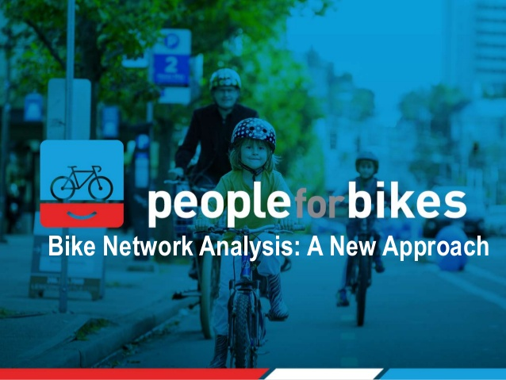

```{r setup, include=FALSE}
options(htmltools.dir.version = FALSE)
```

background-image: url(https://images.unsplash.com/photo-1520560501368-3a6e24ccae04?ixlib=rb-0.3.5&ixid=eyJhcHBfaWQiOjEyMDd9&s=6bbdeadd191e8bfd6efa0726dca1ac4e)
background-size: cover
class: center, top, inverse

## Optimizing connectivity of urban cycling infrastructure through a bike network analysis score based on open data  

---

background-image: url(https://images.unsplash.com/photo-1438183972690-6d4658e3290e?ixlib=rb-0.3.5&s=37f7592381a650554cbdb45337511853)
background-size: cover
class: center, top, inverse

## Research question

<span style="color:red; font-size:30pt; font-family: 'Yanone Kaffeesatz';">Can a quantitative index based on open and/or crowdsourced data serve as a tool for urban planning of well-connected, low-stress cycling networks?
</span>

---
class: center, top

## Aim

Develop a methodology to optimize urban cycling networks’ connectivity based on a quantitative index known as bike network analysis score.

.center[]

---
class: center, top

## Timeline

```{r schedule, warning=FALSE, echo=FALSE, message=FALSE}
library(vistime)

data <- data.frame(
  objective = c(rep("Objective 1", 5), 
                rep("Objective 2", 6),
                rep("Objective 3", 5),
                rep("Objective 4", 2),
                rep("Final steps", 2)),
  activity = c("1.1", "1.2", "1.3", "1.4", "1.5",
              "2.1", "2.2", "2.3", "2.4", "2.5", "2.6",
              "3.1", "3.2", "3.3", "3.4", "3.5", 
              "4.1", "4.2", "Thesis writing", "Presentation"),
  start   = c("2018-09-10", "2018-09-17", "2018-09-24", "2018-10-01", "2018-10-08",
              "2018-10-15", "2018-10-22", "2018-10-29", "2018-11-05", "2018-11-12", "2018-11-19",
              "2018-11-26", "2018-12-03", "2018-12-17", "2018-12-26", "2019-01-04",
              "2019-01-12", "2019-01-21", "2019-01-14", "2019-02-05"),
  end     = c("2018-09-16", "2018-09-23", "2018-09-30", "2018-10-07", "2018-10-14",
              "2018-10-21", "2018-10-28", "2018-11-04", "2018-11-11", "2018-11-18", "2018-11-25",
              "2018-12-08", "2018-12-16", "2018-12-23", "2019-01-03", "2019-01-11",
              "2019-01-20", "2019-01-27", "2019-02-02", NA),
  color   = c("#ff5752", "#fb5b56", "#f65f5a", "#f2645f", "#ee6863",
              "#ec6864", "#e96c67", "#e5706c", "#e17470", "#dc7874", "#d87c79",
              "#d4807d", "#cf8481", "#cb8886", "#c78c8a", "#c2908e",
              "#be9493", "#ba9897", "#b59c9b", "#9f1814")
)

p <- vistime(data, events = "activity", groups = "objective")

# step 1: transform into a list
pp <- plotly_build(p)

# step 2: loop over pp$x$data, and change the font size of all text elements to 10 and times new roman
t <- list(
  family = "times new roman",
  size = 11)

pp$x$data <- lapply(pp$x$data, function(x){
 if(x$mode == "text"){
       x$textfont <- t
       return(x)
  }else{
       return(x)
  }})

# step 3: change axis font

pp$x$layout$xaxis$tickfont <- list(family = "times new roman", size = 12)
pp$x$layout$yaxis$tickfont <- list(family = "times new roman", size = 12)
pp$x$layout$yaxis2$tickfont <- list(family = "times new roman", size = 12)
pp$x$layout$yaxis3$tickfont <- list(family = "times new roman", size = 12)
pp$x$layout$yaxis4$tickfont <- list(family = "times new roman", size = 12)
pp$x$layout$yaxis5$tickfont <- list(family = "times new roman", size = 12)
pp$x$layout$yaxis6$tickfont <- list(family = "times new roman", size = 12)

pp %>%
  layout(autosize = F, width = 1000, height = 500)

pp
```

---
background-image: url(https://images.unsplash.com/photo-1520431626067-a140ac2122f3?ixlib=rb-0.3.5&ixid=eyJhcHBfaWQiOjEyMDd9&s=3ea2f69f37c5648845e4c3ca88838f7a)
background-size: cover
class: center, top

## Objective 1

#### Improve the classification methodology previously developed for street segments (edges) and including also intersections (nodes) conforming the street network of a city into levels of traffic stress based on OpenStreetMap layers, tags, and additional ancillary data.

---

class: center, middle

## First remark:

```{r, echo = FALSE, include = FALSE}
library(RPostgreSQL)

# LOAD POSTGRESQL DRIVER
driver <- dbDriver("PostgreSQL")
# CREATE CONNECTION TO THE POSTGRESQL DATABASE
# THE CONNECTION VARIABLE WILL BE USED FOR ALL FURTHER OPERATIONS
connection <- dbConnect(driver, dbname = "test_osm2pgsql",
                 host = "localhost", port = 5432,
                 user = "postgres", password = "das8410")
library(sf)
slope_ways <- st_read(
  dsn = connection,
  query = "SELECT * FROM generated.sa_ways_slope"
)
```

Slope data generated from DEM downloaded from [Mapzen](https://mapzen.com/) with the `elevatr` package.

Main concern: how to route according to a *climb* or *descent* scenario.

```{r, echo = FALSE}
library(ggplot2)
ggplot() +
  geom_sf(data = slope_ways, aes(colour = slope)) + 
  scale_color_gradientn(colours = terrain.colors(10)) +
  theme_bw() +
  labs(title = "Slope (%)")
```

---
background-image: url(https://images.unsplash.com/photo-1537535214953-ebd2f09377e7?ixlib=rb-0.3.5&ixid=eyJhcHBfaWQiOjEyMDd9&s=7060808893037379d20c38c426bb1388)
background-size: cover
class: center, bottom, inverse


.left[
## Objective 2
]

#### Work upon the existing scoring technique which considers the ability of the low-stress bike network to reach core services within a certain biking distance, considering if possible work places.

---
class: center, middle

## Second remark:

```{r, echo = FALSE, include = FALSE}
library(RPostgreSQL)

# LOAD POSTGRESQL DRIVER
driver <- dbDriver("PostgreSQL")
# CREATE CONNECTION TO THE POSTGRESQL DATABASE
# THE CONNECTION VARIABLE WILL BE USED FOR ALL FURTHER OPERATIONS
connection <- dbConnect(driver, dbname = "test_osm2pgsql",
                 host = "localhost", port = 5432,
                 user = "postgres", password = "das8410")

library(sf)
de_geostat <- st_read(
  dsn = connection,
  query = "SELECT tot_p, geom FROM geostat WHERE cntr_code = 'DE'"
) 

```


```{r, echo = FALSE}
plot(de_geostat, border = NA, main = "GEOSTAT population grid for Germany - 2011")
```

---
background-image: url(https://images.unsplash.com/photo-1458708606976-4af51a03c931?ixlib=rb-0.3.5&s=a4179e64bbd9a6b9973f31fac9800db1)
background-size: cover
class: center, bottom, inverse

## Further Objectives

--
### Objective 3: 

--
#### Establish a methodology to reverse-engineer the process in a way that a desired score can be provided to obtain as a result low-stress network options for a city by introducing bike paths, bike lanes and zone 30 streets, as well as, bike signalling on conflictive intersections.

--
### Objective 4: 

--
#### Apply the methodology as case studies for cities in Europe with limited and/or partly developed bike infrastructure to evaluate the tool performance as a generally applicable methodology for any city and compare the different results.

---
background-image: url(https://images.unsplash.com/photo-1454810945947-518fa697f0cf?ixlib=rb-0.3.5&ixid=eyJhcHBfaWQiOjEyMDd9&s=653af866fd32821840885dc94c74a85d)
background-size: cover
class: center, top, inverse

## Thank you!

--
## Questions?
