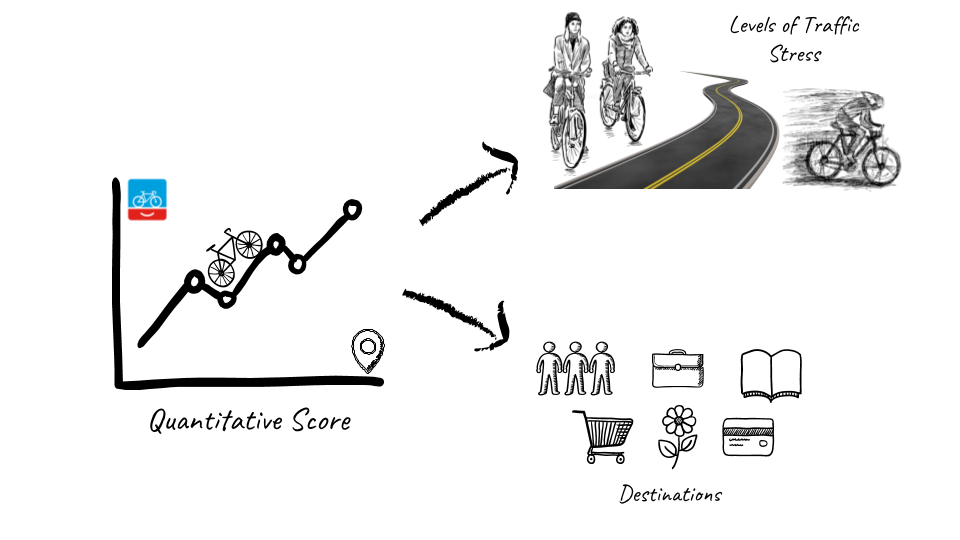
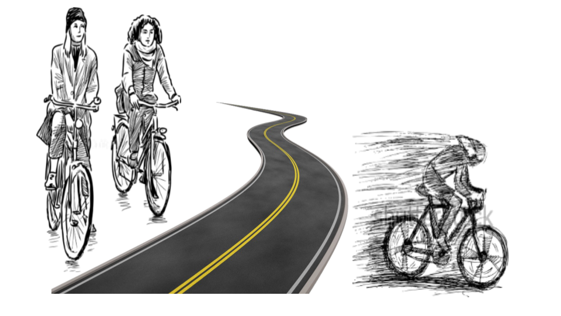
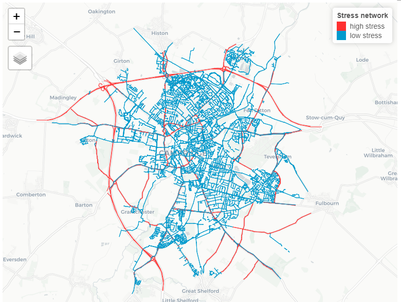
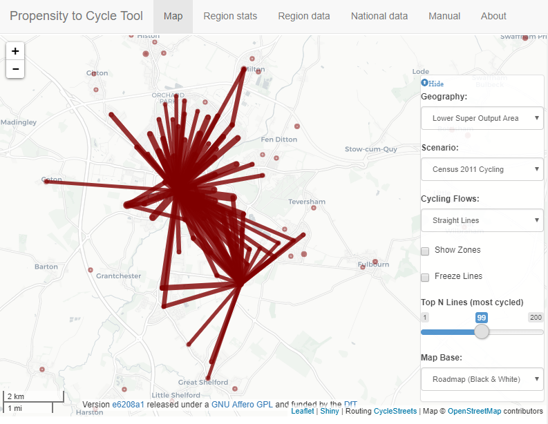
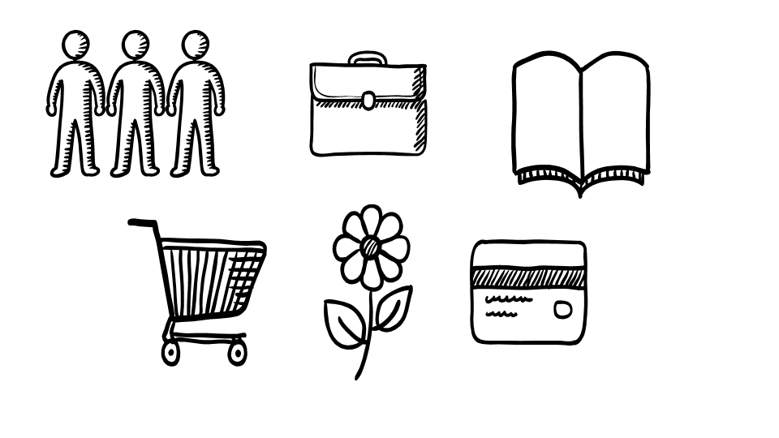
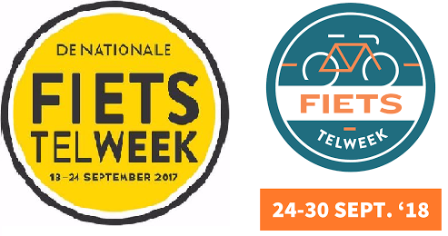
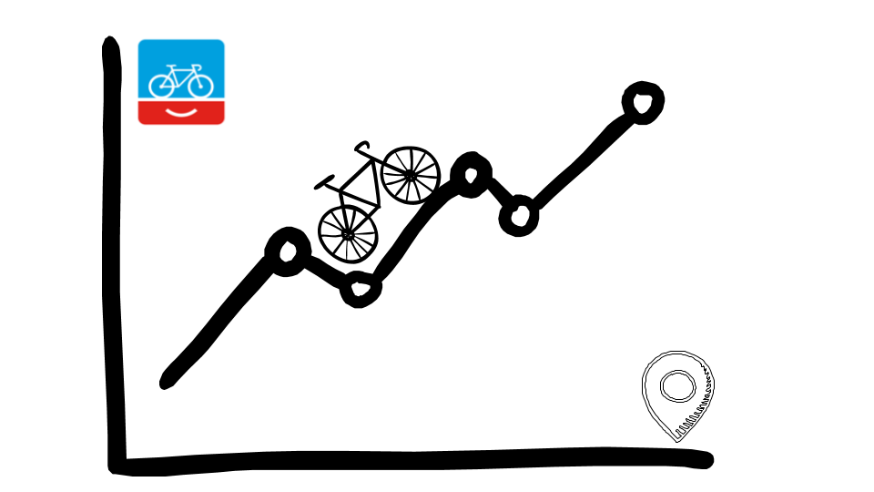
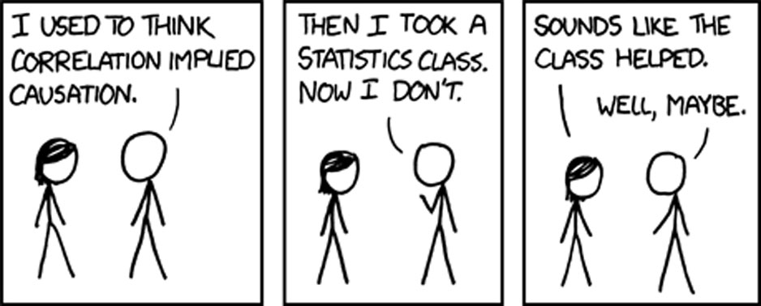

```{r setup, include=FALSE}
options(htmltools.dir.version = FALSE)
```

background-image: url(https://images.unsplash.com/photo-1507035895480-2b3156c31fc8?ixlib=rb-0.3.5&ixid=eyJhcHBfaWQiOjEyMDd9&s=b104c850fee7b7c4035e1477b1c13704)
background-size: cover
class: right, top

## What has happened so far?

--

.pull-left[

### Last presentation:

**Comment:** improve the research question

**To-do:** confirm the validation of the BNA score methodology
]

--
.pull-right[

### During these three weeks:

Talked to *People For Bikes* about BNA score

Discover there has not been scientific validation

Came up with a new research focus
]

---

background-image: url(https://images.unsplash.com/photo-1533641568252-76ce0951d5b4?ixlib=rb-0.3.5&ixid=eyJhcHBfaWQiOjEyMDd9&s=8a77deecf07109831644637cdce27eb6)
background-size: cover
class: left, bottom, inverse

#### New research question

.pull-left[
<span style="color:brown; font-size:30pt; font-family: 'Yanone Kaffeesatz';"> *How accurately can a quantitative index based on open and/or crowdsourced data serve as a tool to evaluate connectivity of low-stress cycling networks?* </span>
]

---
background-image: url(https://images.unsplash.com/photo-1520431626067-a140ac2122f3?ixlib=rb-0.3.5&ixid=eyJhcHBfaWQiOjEyMDd9&s=3ea2f69f37c5648845e4c3ca88838f7a)
background-size: cover
class: center, top

## How I plan to do it?

---
class: center, top

## Breakdown of the BNA score

.center[]
---

## **Hypothesis 1:** People bike more if there is a low stress network connecting their origin to their destination.

.left-column[]

--
.right-column[

.center[

Find a relationship between areas connected by a low stress network and their number of bike trips. 

Data source: [LSOA-flow commute data](https://wicid.ukdataservice.ac.uk/cider/wicid/downloads.php)

]

.pull-left[

]

.pull-right[

]

]

---
## **Hypothesis 2:** People bike more to the highly ranked destinations according to the BNA score

.left-column[

]

--

.right-column[

.center[

This particular hypothesis is harder to test as the OD data I have for the UK is for Travel To Work. 

This means that other purpose trips would not be contemplated in the data.

{{content}}

]

]

--
 
#### Possible approaches: 
{{content}}

--
- Assume that this data is also valid for other trip purposes, and try to weight the results according to the [National Travel Survey](https://assets.publishing.service.gov.uk/government/uploads/system/uploads/attachment_data/file/729521/national-travel-survey-2017.pdf) which gives regional (low spatial resolution) aggregates.
{{content}}

--
- Test this hypothesis on a study area where bike trip data, with precise origin and destinations are available:




{{content}}

---

## **Hypothesis 3:** "There is likely a relationship between connectivity and actual bicycling activity." (Lowry & Hadden, 2017)

.left-column[]

--

.right-column[

.center[

Pearson correlation between BNA score and total number of bike trips for different cities in the UK.

Data source: [LSOA-flow commute data](https://wicid.ukdataservice.ac.uk/cider/wicid/downloads.php) and [National Travel Survey](https://assets.publishing.service.gov.uk/government/uploads/system/uploads/attachment_data/file/729521/national-travel-survey-2017.pdf)


]

]

---

background-image: url(https://images.unsplash.com/photo-1454810945947-518fa697f0cf?ixlib=rb-0.3.5&ixid=eyJhcHBfaWQiOjEyMDd9&s=653af866fd32821840885dc94c74a85d)
background-size: cover
class: center, top, inverse

## Thank you!

--
## Questions/Comments?
