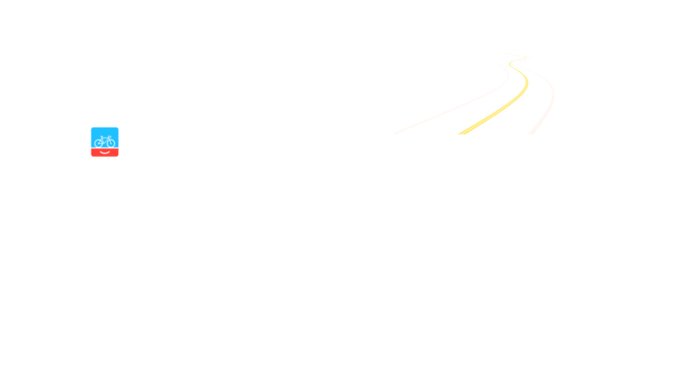
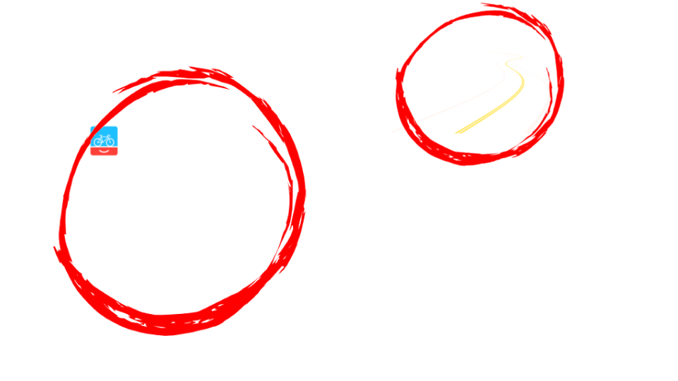
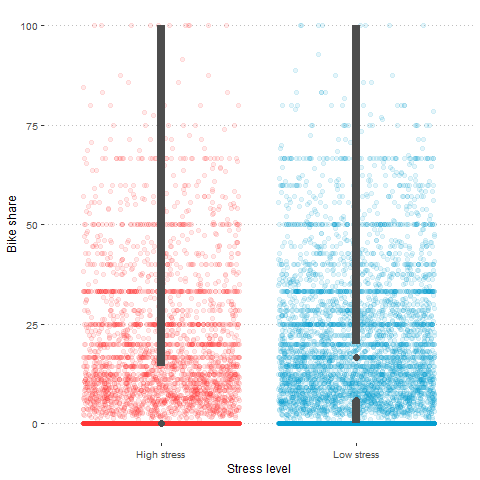
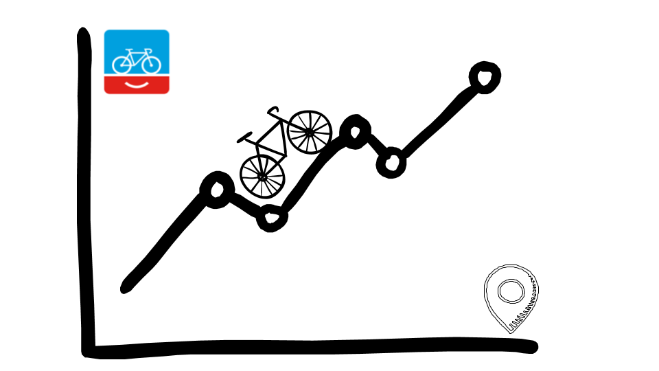

```{r setup, include=FALSE}
options(htmltools.dir.version = FALSE)
load("E:/GeoTech/Thesis/Thesis_R_Project/pres3.RData")
```

background-image: url(https://images.unsplash.com/photo-1507035895480-2b3156c31fc8?ixlib=rb-0.3.5&ixid=eyJhcHBfaWQiOjEyMDd9&s=b104c850fee7b7c4035e1477b1c13704)
background-size: cover
class: right, top

## What has happened so far?

--

.pull-left[

### Last presentation:

Breakdown of the BNA score

Redefined the research question

Established *3* hypothesis to validate the score
]

--
.pull-right[

### During these four weeks:

Run the BNA score for *12* cities in the UK and *10* in the Netherlands

Processed OD data for both countries 

Worked on hypothesis 1 and 3

**GeoMundus 2018**
]

---
class: center, top, inverse

## RECAP: BNA Breakdown


.center[]

---
class: center, top, inverse

## RECAP: BNA Breakdown


.center[]

---

## **Hypothesis 1:** More people bike if there is a low stress network connecting their origin to their destination.

.left-column[]

.right-column[

Comparing number of bike trips between origin-destination pairs grouped by a low or high stress bicycle network connectivity.

The comparisons are presented for both study areas: 

- The United Kingdom (12 cities)

- The Netherlands (10 cities)

]
---

## **Hypothesis 1:** More people bike if there is a low stress network connecting their origin to their destination.

.left-column[


]

.right-column[

```{r, warning=FALSE, echo=FALSE, message=FALSE, fig.width=10, fig.height= 6}
library(ggplot2)
library(plotly)
library(ggthemes)
library(ggpubr)

p1 <- ggplot() + 
  geom_boxplot(
    data = uk_lts_dl, 
    aes(
      reorder(city,total_bike_trips), 
      bikeshare, 
      color = stress_level
    ),
    position = "dodge2", 
    alpha = 0,
    outlier.colour = "red",
    outlier.shape = 20
  ) +
  scale_color_manual(
    values = c("firebrick1", "deepskyblue3")
  ) +
  ylab("Bike share") + xlab("") +
  theme_pubclean() +
  theme(
    legend.key=element_blank(), 
    axis.text = element_text(angle = 90, hjust = 1),
    legend.title=element_blank()
  ) 

p1 <- ggplotly(p1) %>% layout(boxmode = "group") %>% style() %>% 
	layout(legend = list(x = 0, y = 1))

p1$x$data <- lapply(p1$x$data, FUN = function(x){
  x$marker = list(opacity = 0.1, outliercolor = NA)
  return(x)
})

p1
```


]
---

## **Hypothesis 1:** More people bike if there is a low stress network connecting their origin to their destination.

.left-column[


]

.right-column[
.center[]
]

---
## **Hypothesis 1:** More people bike if there is a low stress network connecting their origin to their destination.

.left-column[


]

.right-column[
```{r, echo = F, fig.width=10, fig.height=5}
ggplot() + 
  geom_histogram(
    aes(bike_trips, fill = stress_level), 
    data = uk_lts_dl, 
    binwidth = 1,
    show.legend = FALSE
  ) +
  facet_grid(vars(stress_level)) + 
  scale_fill_manual(
    values = c("firebrick1", "deepskyblue3")
  ) +
  ylab("Bike trips") + xlab("Frequency") +
  theme_pubclean()
```


]
---
## **Hypothesis 1:** More people bike if there is a low stress network connecting their origin to their destination.

.left-column[


]

.right-column[

```{r, warning=F,message=F, echo = F}
library(tmap)
tmap_mode("view")
map <- tmap_leaflet(
  tm_view(basemaps = "CartoDB.Positron") +
    tm_shape(uk_lts_dl %>% filter(city == "oxford")) +
    tm_lines(
      col = "stress_level", 
      lwd = "bikeshare",
      palette = c("firebrick1", "deepskyblue3")
    ) 
)
```

```{r, fig.height=6, fig.width=10, echo = F}
map
```


]

---
## **Hypothesis 1:** More people bike if there is a low stress network connecting their origin to their destination.

.left-column[


]

.right-column[
```{r, warning=FALSE, echo=FALSE, message=FALSE, fig.width=10, fig.height= 6}
p2 <- ggplot() + 
  geom_boxplot(
    data = nl_lts_dl, 
    aes(
      reorder(city,total_bike_trips), 
      log(bike_trips), 
      color = stress_level
    ),
    position = "dodge2", 
    alpha = 0,
    outlier.colour = "red",
    outlier.shape = 20
  ) +
  scale_color_manual(
    values = c("firebrick1", "deepskyblue3")
  ) +
  ylab("Bike trip (log)") + xlab("") +
  theme_pubclean() +
  theme(
    legend.key=element_blank(), 
    axis.text = element_text(angle = 90, hjust = 1),
    legend.title=element_blank()
  )

p2 <- ggplotly(p2) %>% layout(boxmode = "group") %>% style() %>% 
	layout(legend = list(x = 0, y = 1))

p2$x$data <- lapply(p2$x$data, FUN = function(x){
  x$marker = list(opacity = 0.1, outliercolor = NA)
  return(x)
})

p2
```

]

---
## **Hypothesis 1:** More people bike if there is a low stress network connecting their origin to their destination.

.left-column[


]

.right-column[

.center[
```{r, echo = F, fig.height=5}
gg2 <- ggplot(nl_lts_dl, aes(stress_level, log(bike_trips))) +
  geom_jitter(alpha = 0.1, size = 2, aes(color = low_stress)) +
  scale_color_manual(
    values = c("firebrick1", "deepskyblue3")
  ) +
  geom_tufteboxplot(
    color = "grey30",
    lwd = 3,
    outlier.colour = NA
  ) +
  ylab("Bike trip (log)") + xlab("Stress level") +
  theme_pubclean() +
  theme(legend.position = "none")

gg2
```

]
]

---
## **Hypothesis 1:** More people bike if there is a low stress network connecting their origin to their destination.

.left-column[


]

.right-column[
```{r, echo=F, fig.width=10, fig.height=5}
ggplot() + 
  geom_histogram(
    aes(bike_trips, fill = stress_level), 
    data = nl_lts_dl, 
    binwidth = 1,
    show.legend = FALSE
  ) +
  facet_grid(vars(stress_level)) + 
  scale_fill_manual(
    values = c("firebrick1", "deepskyblue3")
  ) +
  ylab("Bike trips") + xlab("Frequency") +
  theme_pubclean()
```

]
---
## **Hypothesis 3:** "There is likely a relationship between connectivity and actual bicycling activity." (Lowry & Hadden, 2017)

.left-column[]

.right-column[
```{r, echo = F, fig.width=10, fig.height=5}
ggscatter(
  city_bna_join,
  x = "bike_trips",
  y = "bna_values",
  add = "reg.line",  # Add regressin line
  conf.int = TRUE,# Add confidence interval
  color = "countries",
  label = "city",
  label.select = c(
    "york", "utrecht","cambridge",
    "worcester","venlo","cheltenham",
    "bridgend","enschede","oxford"
  ),
  font.label = c(8,"italic"),
  shape = 19,
  palette = c("orange","blue"),
  show.legend.text = F
) +
  stat_cor(
    aes(
      color = countries,
      label = paste(..rr.label.., ..p.label.., sep = "~`,`~")
    ),
    label.x = 2000
  ) +
  xlab("Bike trips") + ylab("BNA score") +
  theme_pubclean() +
  theme(
    legend.title = element_blank(),
    legend.spacing.x = unit(3,"mm")
  )
```
]

---

## **Hypothesis 3:** "There is likely a relationship between connectivity and actual bicycling activity." (Lowry & Hadden, 2017)

.left-column[


```{r, echo = F, fig.width=10, message=F,warning=F}
library(viridis)
# Build legend 3 x 3 
d<-expand.grid(x=1:3,y=1:3)
d<-merge(d,data.frame(x=1:3,xlabel=c("BNA low", "BNA middle","BNA high")),by="x")
d<-merge(d,data.frame(y=1:3,ylabel=c("BTPHI low", "BTPHI middle","BTPHI high")),by="y")


#make legend:
g.legend<-
  ggplot(d, aes(x,y,fill=atan(y/x),alpha=x+y,label=paste0(xlabel,"\n",ylabel)))+
  geom_tile()+
  scale_fill_viridis(option = "C")+
  theme_void()+
  theme(legend.position="none",
        panel.background=element_blank(),
        plot.margin=margin(t=10,b=10,l=10))+
  labs(title=" ",x="BNA",y="BTPHI") +
    #subtitle="Bike trips per 100 inhabitants (BT/100I)\nand BNA score (BNA)")+
    #subtitle="A bivariate color scheme (Viridis)",x="HPA",y="Emp Growth")+
  theme(axis.title=element_text(color="black",size = 30))+
  # Draw some arrows:
  geom_segment(aes(x=1, xend = 3 , y=0, yend = 0), size=1.5,
               arrow = arrow(length = unit(0.6,"cm"))) +
  geom_segment(aes(x=0, xend = 0 , y=1, yend = 3), size=1.5,
               arrow = arrow(length = unit(0.6,"cm"))) 
g.legend 
```

]

.right-column[
```{r, echo = F, fig.width=11,fig.height=6}
gmap_bedford <-
ggplot() +
  geom_sf(data = origin_bna_join %>% filter(city == "bedford"),
           aes(fill =atan(y/x),alpha=x+y),
           color = "white") +
  theme_map(base_size = 12) +
  theme(plot.title=element_text(size = 12, face="bold",margin=margin(b=10)),
        panel.grid.major = element_line(colour = 'transparent')) +
  scale_fill_viridis(option = "C")+guides(alpha=F,fill=F) +
  labs(caption = "Bedford, UK")

gmap_bridgend <-
ggplot() +
  geom_sf(data = origin_bna_join %>% filter(city == "bridgend"),
           aes(fill =atan(y/x),alpha=x+y),
           color = "white") +
  theme_map(base_size = 12) +
  theme(plot.title=element_text(size = 12, face="bold",margin=margin(b=10)),
        panel.grid.major = element_line(colour = 'transparent')) +
  scale_fill_viridis(option = "C")+guides(alpha=F,fill=F) +
  labs(caption = "Bridgend, UK")

gmap_cambridge <-
ggplot() +
  geom_sf(data = origin_bna_join %>% filter(city == "cambridge"),
           aes(fill =atan(y/x),alpha=x+y),
           color = "white") +
  theme_map(base_size = 12) +
  theme(plot.title=element_text(size = 12, face="bold",margin=margin(b=10)),
        panel.grid.major = element_line(colour = 'transparent')) +
  scale_fill_viridis(option = "C")+guides(alpha=F,fill=F) +
  labs(caption = "Cambridge,UK")

gmap_chelmsford <-
ggplot() +
  geom_sf(data = origin_bna_join %>% filter(city == "chelmsford"),
           aes(fill =atan(y/x),alpha=x+y),
           color = "white") +
  theme_map(base_size = 12) +
  theme(plot.title=element_text(size = 12, face="bold",margin=margin(b=10)),
        panel.grid.major = element_line(colour = 'transparent')) +
  scale_fill_viridis(option = "C")+guides(alpha=F,fill=F) +
  labs(caption = "Chelmsford, UK")

gmap_cheltenham <-
ggplot() +
  geom_sf(data = origin_bna_join %>% filter(city == "cheltenham"),
           aes(fill =atan(y/x),alpha=x+y),
           color = "white") +
  theme_map(base_size = 12) +
  theme(plot.title=element_text(size = 12, face="bold",margin=margin(b=10)),
        panel.grid.major = element_line(colour = 'transparent')) +
  scale_fill_viridis(option = "C")+guides(alpha=F,fill=F) +
  labs(caption = "Cheltenham, UK")

gmap_chesterfield <-
ggplot() +
  geom_sf(data = origin_bna_join %>% filter(city == "chesterfield"),
           aes(fill =atan(y/x),alpha=x+y),
           color = "white") +
  theme_map(base_size = 12) +
  theme(plot.title=element_text(size = 12, face="bold",margin=margin(b=10)),
        panel.grid.major = element_line(colour = 'transparent')) +
  scale_fill_viridis(option = "C")+guides(alpha=F,fill=F) +
  labs(caption = "Chesterfield, UK")

gmap_lincoln <-
ggplot() +
  geom_sf(data = origin_bna_join %>% filter(city == "lincoln"),
           aes(fill =atan(y/x),alpha=x+y),
           color = "white") +
  theme_map(base_size = 12) +
  theme(plot.title=element_text(size = 12, face="bold",margin=margin(b=10)),
        panel.grid.major = element_line(colour = 'transparent')) +
  scale_fill_viridis(option = "C")+guides(alpha=F,fill=F) +
  labs(caption = "Lincoln, UK")

gmap_maidstone <-
ggplot() +
  geom_sf(data = origin_bna_join %>% filter(city == "maidstone"),
           aes(fill =atan(y/x),alpha=x+y),
           color = "white") +
  theme_map(base_size = 12) +
  theme(plot.title=element_text(size = 12, face="bold",margin=margin(b=10)),
        panel.grid.major = element_line(colour = 'transparent')) +
  scale_fill_viridis(option = "C")+guides(alpha=F,fill=F) +
  labs(caption = "Maidstone, UK")

gmap_newport <-
ggplot() +
  geom_sf(data = origin_bna_join %>% filter(city == "newport"),
           aes(fill =atan(y/x),alpha=x+y),
           color = "white") +
  theme_map(base_size = 12) +
  theme(plot.title=element_text(size = 12, face="bold",margin=margin(b=10)),
        panel.grid.major = element_line(colour = 'transparent')) +
  scale_fill_viridis(option = "C")+guides(alpha=F,fill=F) +
  labs(caption = "Newport, UK")

gmap_oxford <-
ggplot() +
  geom_sf(data = origin_bna_join %>% filter(city == "oxford"),
           aes(fill =atan(y/x),alpha=x+y),
           color = "white") +
  theme_map(base_size = 12) +
  theme(plot.title=element_text(size = 12, face="bold",margin=margin(b=10)),
        panel.grid.major = element_line(colour = 'transparent')) +
  scale_fill_viridis(option = "C")+guides(alpha=F,fill=F) +
  labs(caption = "Oxford, UK")

gmap_worcester <-
ggplot() +
  geom_sf(data = origin_bna_join %>% filter(city == "worcester"),
           aes(fill =atan(y/x),alpha=x+y),
           color = "white") +
  theme_map(base_size = 12) +
  theme(plot.title=element_text(size = 12, face="bold",margin=margin(b=10)),
        panel.grid.major = element_line(colour = 'transparent')) +
  scale_fill_viridis(option = "C")+guides(alpha=F,fill=F) +
  labs(caption = "Worcester, UK")

gmap_york <-
ggplot() +
  geom_sf(data = origin_bna_join %>% filter(city == "york"),
           aes(fill =atan(y/x),alpha=x+y),
           color = "white") +
  theme_map(base_size = 12) +
  theme(plot.title=element_text(size = 12, face="bold",margin=margin(b=10)),
        panel.grid.major = element_line(colour = 'transparent')) +
  scale_fill_viridis(option = "C")+guides(alpha=F,fill=F) +
  labs(caption = "York, UK")

ggarrange(
  gmap_bedford, gmap_bridgend, gmap_cambridge, 
  gmap_chelmsford, gmap_cheltenham, gmap_chesterfield, 
  gmap_lincoln, gmap_maidstone, gmap_newport,
  gmap_oxford, gmap_worcester, gmap_york, nrow = 2, ncol = 6
)
```
]

---

## **Hypothesis 3:** "There is likely a relationship between connectivity and actual bicycling activity." (Lowry & Hadden, 2017)

.left-column[


```{r, echo = F, fig.width=10, message=F,warning=F}
library(viridis)
# Build legend 3 x 3 
d<-expand.grid(x=1:3,y=1:3)
d<-merge(d,data.frame(x=1:3,xlabel=c("BNA low", "BNA middle","BNA high")),by="x")
d<-merge(d,data.frame(y=1:3,ylabel=c("BTPHI low", "BTPHI middle","BTPHI high")),by="y")


#make legend:
g.legend<-
  ggplot(d, aes(x,y,fill=atan(y/x),alpha=x+y,label=paste0(xlabel,"\n",ylabel)))+
  geom_tile()+
  scale_fill_viridis(option = "C")+
  theme_void()+
  theme(legend.position="none",
        panel.background=element_blank(),
        plot.margin=margin(t=10,b=10,l=10))+
  labs(title=" ",x="BNA",y="BTPHI") +
    #subtitle="Bike trips per 100 inhabitants (BT/100I)\nand BNA score (BNA)")+
    #subtitle="A bivariate color scheme (Viridis)",x="HPA",y="Emp Growth")+
  theme(axis.title=element_text(color="black",size = 30))+
  # Draw some arrows:
  geom_segment(aes(x=1, xend = 3 , y=0, yend = 0), size=1.5,
               arrow = arrow(length = unit(0.6,"cm"))) +
  geom_segment(aes(x=0, xend = 0 , y=1, yend = 3), size=1.5,
               arrow = arrow(length = unit(0.6,"cm"))) 
g.legend 
```
]

.right-column[
```{r, echo = F, fig.width=11,fig.height=6}
gmap_apeldoorn <-
ggplot() +
  geom_sf(data = origin_bna_join %>% filter(city == "apeldoorn"),
           aes(fill =atan(y/x),alpha=x+y),
           color = "white") +
  theme_map(base_size = 12) +
  theme(plot.title=element_text(size = 12, face="bold",margin=margin(b=10)),
        panel.grid.major = element_line(colour = 'transparent')) +
  scale_fill_viridis(option = "C")+guides(alpha=F,fill=F) +
  labs(caption = "Apeldoorn, NL")

gmap_breda <-
ggplot() +
  geom_sf(data = origin_bna_join %>% filter(city == "breda"),
           aes(fill =atan(y/x),alpha=x+y),
           color = "white") +
  theme_map(base_size = 12) +
  theme(plot.title=element_text(size = 12, face="bold",margin=margin(b=10)),
        panel.grid.major = element_line(colour = 'transparent')) +
  scale_fill_viridis(option = "C")+guides(alpha=F,fill=F) +
  labs(caption = "Breda, NL")

gmap_delft <-
ggplot() +
  geom_sf(data = origin_bna_join %>% filter(city == "delft"),
           aes(fill =atan(y/x),alpha=x+y),
           color = "white") +
  theme_map(base_size = 12) +
  theme(plot.title=element_text(size = 12, face="bold",margin=margin(b=10)),
        panel.grid.major = element_line(colour = 'transparent')) +
  scale_fill_viridis(option = "C")+guides(alpha=F,fill=F) +
  labs(caption = "Delft, NL")

gmap_enschede <-
ggplot() +
  geom_sf(data = origin_bna_join %>% filter(city == "enschede"),
           aes(fill =atan(y/x),alpha=x+y),
           color = "white") +
  theme_map(base_size = 12) +
  theme(plot.title=element_text(size = 12, face="bold",margin=margin(b=10)),
        panel.grid.major = element_line(colour = 'transparent')) +
  scale_fill_viridis(option = "C")+guides(alpha=F,fill=F) +
  labs(caption = "Enschede, NL")

gmap_gouda <-
ggplot() +
  geom_sf(data = origin_bna_join %>% filter(city == "gouda"),
           aes(fill =atan(y/x),alpha=x+y),
           color = "white") +
  theme_map(base_size = 12) +
  theme(plot.title=element_text(size = 12, face="bold",margin=margin(b=10)),
        panel.grid.major = element_line(colour = 'transparent')) +
  scale_fill_viridis(option = "C")+guides(alpha=F,fill=F) +
  labs(caption = "Gouda, NL")

gmap_groningen <-
ggplot() +
  geom_sf(data = origin_bna_join %>% filter(city == "groningen"),
           aes(fill =atan(y/x),alpha=x+y),
           color = "white") +
  theme_map(base_size = 12) +
  theme(plot.title=element_text(size = 12, face="bold",margin=margin(b=10)),
        panel.grid.major = element_line(colour = 'transparent')) +
  scale_fill_viridis(option = "C")+guides(alpha=F,fill=F) +
  labs(caption = "Groningen, NL")

example_cities <- c(
  "bedford", "bridgend", "cambridge",
  "chelmsford", "cheltenham", "chesterfield",
  "lincoln", "maidstone", "newport",
  "oxford", "worcester", "york",
  "apeldoorn", "breda", "delft",
  "enschede", "gouda", "groningen",
  "nijmegen", "utrecht", "venlo","zwolle"
)
gmap_nijmegen <-
ggplot() +
  geom_sf(data = origin_bna_join %>% filter(city == "nijmegen"),
           aes(fill =atan(y/x),alpha=x+y),
           color = "white") +
  theme_map(base_size = 12) +
  theme(plot.title=element_text(size = 12, face="bold",margin=margin(b=10)),
        panel.grid.major = element_line(colour = 'transparent')) +
  scale_fill_viridis(option = "C")+guides(alpha=F,fill=F) +
  labs(caption = "Nijmegen, NL")

gmap_utrecht <-
ggplot() +
  geom_sf(data = origin_bna_join %>% filter(city == "utrecht"),
           aes(fill =atan(y/x),alpha=x+y),
           color = "white") +
  theme_map(base_size = 12) +
  theme(plot.title=element_text(size = 12, face="bold",margin=margin(b=10)),
        panel.grid.major = element_line(colour = 'transparent')) +
  scale_fill_viridis(option = "C")+guides(alpha=F,fill=F) +
  labs(caption = "Utrecht, NL")

gmap_venlo <-
ggplot() +
  geom_sf(data = origin_bna_join %>% filter(city == "venlo"),
           aes(fill =atan(y/x),alpha=x+y),
           color = "white") +
  theme_map(base_size = 12) +
  theme(plot.title=element_text(size = 12, face="bold",margin=margin(b=10)),
        panel.grid.major = element_line(colour = 'transparent')) +
  scale_fill_viridis(option = "C")+guides(alpha=F,fill=F) +
  labs(caption = "Venlo, NL")


gmap_zwolle <-
ggplot() +
  geom_sf(data = origin_bna_join %>% filter(city == "zwolle"),
           aes(fill =atan(y/x),alpha=x+y),
           color = "white") +
  theme_map(base_size = 12) +
  theme(plot.title=element_text(size = 12, face="bold",margin=margin(b=10)),
        panel.grid.major = element_line(colour = 'transparent')) +
  scale_fill_viridis(option = "C")+guides(alpha=F,fill=F) +
  labs(caption = "Zwolle, NL")

ggarrange(
  gmap_apeldoorn, gmap_breda, gmap_delft, 
  gmap_enschede, gmap_gouda, gmap_groningen, 
  gmap_nijmegen, gmap_utrecht, gmap_venlo,
  gmap_zwolle, nrow = 2, ncol = 5
)
```

]
---
background-image: url(https://images.unsplash.com/photo-1507035895480-2b3156c31fc8?ixlib=rb-0.3.5&ixid=eyJhcHBfaWQiOjEyMDd9&s=b104c850fee7b7c4035e1477b1c13704)
background-size: cover
class: center, top

## What will happen next?

*...*

*...*

--

Determine an adequate statistical test for my data type: count data (with excesive zeros): (zero inflated) poisson?

--

Test hypothesis 2: *More people bike to the highly ranked destinations according to the BNA score*.

--

Establish an adequate normalization method to compare bike trips per origin-destination area, and correlate the data at this aggregation level.

---

background-image: url(https://images.unsplash.com/photo-1454810945947-518fa697f0cf?ixlib=rb-0.3.5&ixid=eyJhcHBfaWQiOjEyMDd9&s=653af866fd32821840885dc94c74a85d)
background-size: cover
class: center, top, inverse

## Thank you!

--
## Questions/Comments?
