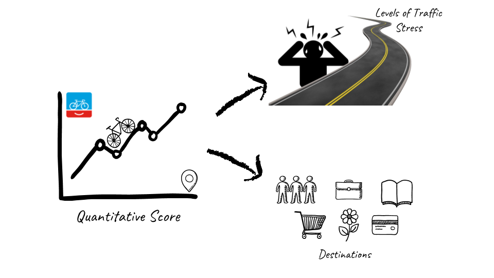
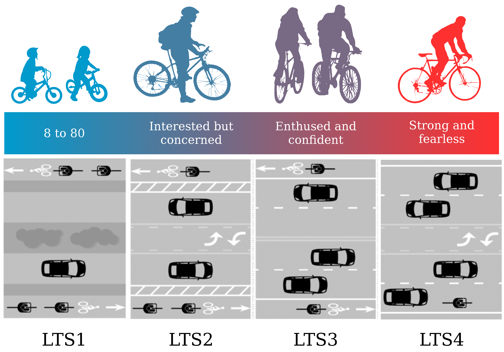
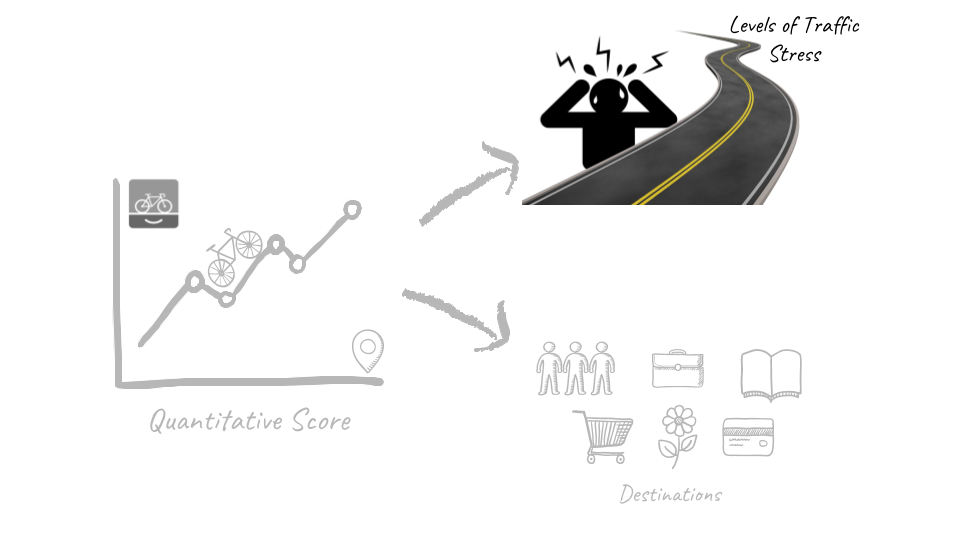
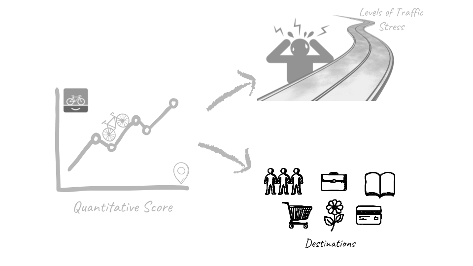
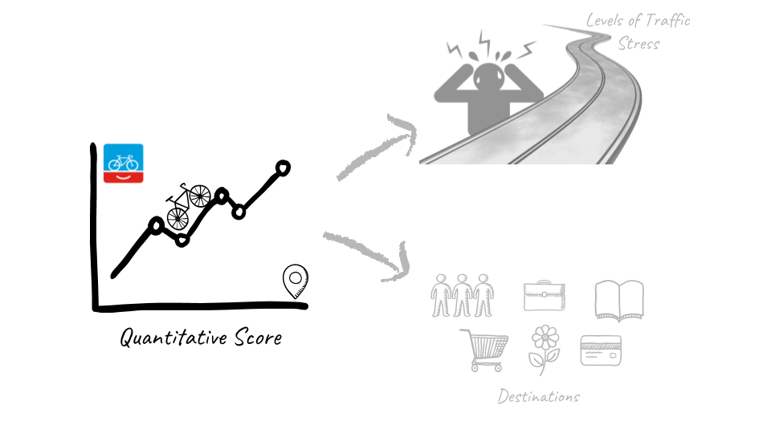

```{r setup, include=FALSE}
options(htmltools.dir.version = FALSE)
load("pres4.RData")
library(ggplot2)
library(ggpubr)
library(ggthemes)
library(dplyr)
library(grid)
library(gridExtra)
library(tools)
library(waffle)
library(ggrepel)
library(extrafont)
```

background-image: url(https://images.unsplash.com/photo-1507035895480-2b3156c31fc8?ixlib=rb-0.3.5&ixid=eyJhcHBfaWQiOjEyMDd9&s=b104c850fee7b7c4035e1477b1c13704)
background-size: cover
class: right, top

## What has happened so far?

--

.pull-left[

### Last presentation:

Preliminary results for hypothesis 1 and 3 

Shared some doubts...
]

--
.pull-right[

### During these four weeks:

Added 19 more example cities in the UK

Came up with a better normalization for the data

Finished testing my three hypothesis

Writing...
]

---
class: center, top

## BNA Breakdown


.center[]

---
class: center, top

## Levels of Traffic Stress


.center[]

---
class: center, top

## **Hypothesis 1** 

More people bike if there is a low stress network connecting their origin to their destination.

.center[]
---
class: center, top

.left-column[

.center[


**Hypothesis 1** 

More people bike if there is a low stress network connecting their origin to their destination.

```{r, echo = F, message = F, Warning = F, fig.height=6, fig.width=5}
ggplot() +
  geom_sf(data = uk, color = "white", fill = "grey90") +
  geom_sf(
    data = uk_lsoa_cities, 
    fill = "deepskyblue3", 
    alpha = 0.5, 
    color = NA
  ) +
  theme_map() +
  theme(
    panel.grid.major = element_line(colour = 'transparent')
  ) 
```


]
]

.right-column[

```{r, echo = F, fig.width=13, fig.height=10}
ggplot() + 
  geom_boxplot(
    data = lts_zones, 
    aes(
      reorder(city,total_bike_trips), 
      bikeshare, 
      color = stress_level
    ),
    position = "dodge2", 
    alpha = 0,
    outlier.colour = "red",
    outlier.shape = 20
  ) +
  scale_color_manual(
    values = c("firebrick1", "deepskyblue3")
  ) +
  coord_flip() +
  ylab("Bike share (%)") + xlab("") +
  theme_pubclean() +
  theme(
    legend.key=element_blank(), 
    axis.text = element_text(angle = 0, hjust = 1),
    legend.title=element_blank(),
    legend.position = c(0.8,0.2),
    text = element_text(family = 'serif', size = 22)
  ) 
```
]

---
class: center, middle

.left-column[

.center[


**Hypothesis 1** 

More people bike if there is a low stress network connecting their origin to their destination.

```{r, echo = F, message = F, Warning = F,  fig.height=8, fig.width=7}
ggplot() +
  geom_sf(data = uk, color = "white", fill = "grey90") +
  geom_sf(
    data = uk_lsoa_cities, 
    fill = "deepskyblue3", 
    alpha = 0.5, 
    color = NA
  ) +
  theme_map() +
  theme(
    panel.grid.major = element_line(colour = 'transparent')
  ) 
```
]
]

.right-column[

.pull-left[
*Welch Two Sample T-test*

p-value = 8.703e-07

alternative hypothesis: true difference in means is not equal to 0
]

.pull-right[
*Mann-Whitney test*

p-value < 2.2e-16

alternative hypothesis: true location shift is not equal to 0
]

.center[
```{r, echo = F, fig.width=8, fig.height=6}
ggplot(lts_zones, aes(stress_level, bikeshare)) +
  geom_jitter(alpha = 0.1, size = 1, aes(color = low_stress)) +
  scale_color_manual(
    values = c("firebrick1", "deepskyblue3")
  ) +
  geom_tufteboxplot(
    color = "grey30",
    lwd = 2,
    outlier.colour = NA
  ) +
  ylab("Bike share (%)") + xlab("Stress level") +
  theme_tufte() +
  theme(
    legend.position = "none",
    panel.grid.major.y = element_line(
      color = "grey90", 
      linetype = "dotted"
    ),
    text = element_text(size=18)
  )
```
]

]

???

Welch Two Sample t-test 

Different variances 
Significant difference between the mean of both groups, i.e. the percentage of bike trips between OD pairs is significantly higher on a low stress bike network.

Non-parametric distribution: Mann-Whitney test to check if the populations differ

At 5% significance level it can be concluded that the percentage of trips done by bike on a low or high stress connection are from nonidentical populations.

---
class: center, top

## **Hypothesis 2** 

More people bike to the highly ranked destinations according to the BNA score.

.center[]

---
class: center, middle

.left-column[

.center[


**Hypothesis 2** 

More people bike to the highly ranked destinations according to the BNA score.

```{r, echo = F, message = F, Warning = F,  fig.height=8, fig.width=7}
ggplot() +
  geom_sf(data = nl, color = NA, fill = "grey90") +
  geom_sf(
    data = nl_sel,
    fill = "firebrick1",
    alpha = 0.5,
    color = NA
  ) +
  theme_map() +
  theme(
    panel.grid.major = element_line(colour = 'transparent')
  ) 
```
]
]

.right-column[
```{r, echo = F, fig.width=11, fig.height=8}
nl_dest_ftw_bna %>% 
  mutate(dest_type = toTitleCase(as.character(dest_type))) %>% 
  mutate(
  dest_type = 
    factor(
      dest_type,
      levels = toTitleCase(
          c(
          'school', 'college','university',
          'doctor','dentist','hospital','pharmacy','supermarket','social_services',
          'park','community_center',
          'retail',
          'transit'
        )
      )
    )
  ) %>% 
  group_by(municipality) %>% 
  mutate(count = n()) %>% 
  ungroup() %>% 
  ggplot(
    aes(
      x = reorder(municipality,count),
      fill = reorder(municipality,count)
    )
  ) +
  geom_bar(position = 'dodge') +
  facet_wrap(~dest_type, ncol = 5) +
  coord_flip() +
  scale_fill_manual(
    values = rev(
        c(
        '#0199CC','#188FBD','#3A81A9',
        # '#487CA0',
        '#4E799C','#5A7495','#666F8E',
        # '#736985',
        '#965B70','#C94650',
        # '#D4414A',
        '#E8393D','#FF3030'
      )
    ),
    guide = FALSE
  ) +
  ylab("Count") + xlab("") +
  theme_pubclean() +
  theme(
    text = element_text(family = 'serif', size = 18),
    strip.background = element_blank(),
    panel.grid.major.x = element_line(color = 'grey70', linetype = 'dotted')
  )
```

]

---
class: center, middle

.left-column[

.center[


**Hypothesis 2** 

More people bike to the highly ranked destinations according to the BNA score.

```{r, echo = F, message = F, Warning = F,  fig.height=8, fig.width=7}
ggplot() +
  geom_sf(data = nl, color = NA, fill = "grey90") +
  geom_sf(
    data = nl_sel,
    fill = "firebrick1",
    alpha = 0.5,
    color = NA
  ) +
  theme_map() +
  theme(
    panel.grid.major = element_line(colour = 'transparent')
  ) 
```
]
]

.right-column[
```{r, echo = F, fig.width = 11, fig.height=8}
compare %>% 
  select(type,imp_prop,count_prop) %>% 
  reshape2::melt(id = 'type') %>% 
  mutate(percent = round(100*value,2)) %>% 
  ggplot(
    aes(
      x = factor(
        type,
        levels = rev(c(
          'school', 'college','university',
          'doctor','dentist','hospital','pharmacy','supermarket','social_services',
          'park','community_center',
          'retail',
          'transit'
        )
      )),
      y = value, 
      color = factor(
        type,
        levels = rev(c(
          'school', 'college','university',
          'doctor','dentist','hospital','pharmacy','supermarket','social_services',
          'park','community_center',
          'retail',
          'transit'
        )
      )),
      fill = variable,
      label = paste(percent,'%')
    )
  ) +
  geom_col(
    lwd = 1,
    width = 0.8,
    position = 'dodge'
  ) + 
  scale_y_continuous(labels = scales::percent, limits = c(NA,0.4)) +
  geom_text(
    position = position_dodge(width = 1),
    hjust = -0.1,
    size = 5, 
    family = 'serif',
    fontface = 'bold',
    color = 'grey30'
  ) +
  scale_fill_manual(
    labels = c('BNA importance','FTW trips'),
    values = c('grey90','grey60')
  ) +
  guides(fill = guide_legend(reverse = T)) +
  scale_color_manual(
    values = rev(
        c(
        '#0199CC','#188FBD','#3A81A9',
        '#487CA0',
        '#4E799C','#5A7495','#666F8E',
        '#736985',
        '#965B70','#C94650',
        '#D4414A',
        '#E8393D','#FF3030'
      )
    ),
    guide = FALSE
  ) +
  theme_pubclean() +
  theme(
    legend.title = element_blank(),
    legend.position = c(0.8,0.8),
    title = element_blank(),
    text = element_text(family = 'serif', size = 20)
  ) + coord_flip()
```

]

---
class: center, middle

.left-column[

.center[


**Hypothesis 2** 

More people bike to the highly ranked destinations according to the BNA score.

```{r, echo = F, message = F, Warning = F,  fig.height=8, fig.width=7}
ggplot() +
  geom_sf(data = nl, color = NA, fill = "grey90") +
  geom_sf(
    data = nl_sel,
    fill = "firebrick1",
    alpha = 0.5,
    color = NA
  ) +
  theme_map() +
  theme(
    panel.grid.major = element_line(colour = 'transparent')
  ) 
```
]
]

.right-column[
```{r, echo = F, fig.height=8,fig.width=8}
ggplot(
  data = compare,
  aes(
    y = imp_prop,
    x = count_prop
  )
) +
geom_point(color = 'grey60', size = 1) +
geom_text_repel(
  aes(
    label = type, 
    size = imp_prop + count_prop,
    color = factor(
      type,
      levels = rev(c(
        'school', 'college','university',
        'doctor','dentist','hospital','pharmacy','supermarket','social_services',
        'park','community_center',
        'retail',
        'transit'
      )
    ))
  ),
  color = 'grey60',
  angle = 0,
  min.segment.length = 0.25,
  family = 'serif',
  fontface = 'bold'
) +
coord_fixed() + 
xlab('FTW count') + ylab('BNA importance') +
geom_label(
  aes(
    label = 'Overestimation', x = 0.25, y = 0.35
  ),
  family = 'serif',
  color = 'deepskyblue3',
  size = 6
) +
geom_label(
  aes(
    label = 'Underestimation', x = 0.35, y = 0.25
  ),
  family = 'serif',
  color = 'deepskyblue3',
  size = 6
) +
geom_abline(intercept =0 , slope = 1, linetype = 'dashed', color = 'firebrick1', lwd = 1) +
scale_size_continuous(
  breaks = c(0.07,0.1,0.15,0.2,0.25,0.35), 
  range = c(3,8), 
  guide = F
) +
theme_bw() +
scale_x_continuous(
  labels = scales::percent,
  limits = c(0,0.4),
  breaks = seq(from = 0, to = 0.4, by = 0.1)
) +
scale_y_continuous(
  labels = scales::percent,
  limits = c(0,0.4),
  breaks = seq(from = 0, to = 0.4, by = 0.1)
) +
theme(
  rect = element_blank(),
  text = element_text(family = 'serif', size = 15)
)

```
]

---
class: center, top
## **Hypothesis 3** 

"There is likely a relationship between connectivity and actual bicycling activity." (Lowry & Hadden, 2017)

.center[]

---
class: center, middle

.left-column[

.center[


**Hypothesis 3** 

There is likely a relationship between connectivity and actual bicycling activity.

```{r, echo = F, message = F, Warning = F, fig.height=8, fig.width=7}
ggplot() +
  geom_sf(data = uk, color = "white", fill = "grey90") +
  geom_sf(
    data = uk_lsoa_cities, 
    fill = "deepskyblue3", 
    alpha = 0.5, 
    color = NA
  ) +
  theme_map() +
  theme(
    panel.grid.major = element_line(colour = 'transparent')
  ) 
```
]
]

.right-column[
```{r, echo = F,fig.width=11, fig.height=7}
grid.newpage()
grid.draw(ggsc)
```
]


---
background-image: url(https://images.unsplash.com/photo-1507035895480-2b3156c31fc8?ixlib=rb-0.3.5&ixid=eyJhcHBfaWQiOjEyMDd9&s=b104c850fee7b7c4035e1477b1c13704)
background-size: cover
class: center, top

## What will happen next?

*...*

--

Writing the final document

--

_If there is enough time:_

Create a shiny app

Enhance the code and put it into an R package

---

background-image: url(https://images.unsplash.com/photo-1454810945947-518fa697f0cf?ixlib=rb-0.3.5&ixid=eyJhcHBfaWQiOjEyMDd9&s=653af866fd32821840885dc94c74a85d)
background-size: cover
class: center, top, inverse

## Thank you!

--
## Questions/Comments?
