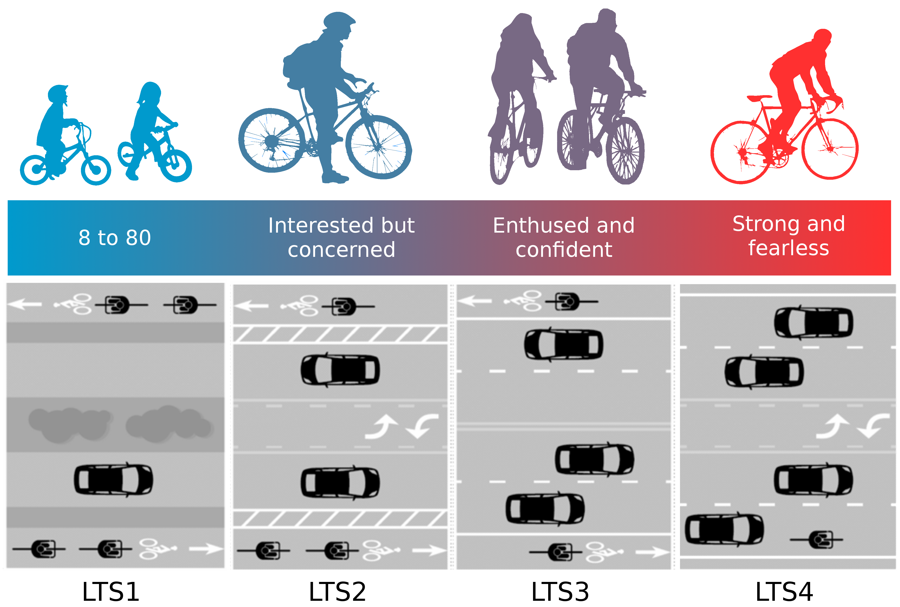

```{r setup, include=FALSE}
options(htmltools.dir.version = FALSE)

load('../Thesis_Document/index/data/chap4.RData')
load('../Thesis_Document/index/data/chap5.RData')
load('../Thesis_Document/index/data/chap5_val.RData')
load('../Presentations/pres5.RData')

library(knitr)
library(ggplot2)
library(ggpubr)
library(ggthemes)
library(dplyr)
library(grid)
library(gridExtra)
library(tools)
library(ggspatial)
library(ggrepel)
library(sf)
library(tmap)
library(showtext)
library(rnaturalearth)
library(rnaturalearthdata)
library(moments)
library(pander)
library(ggExtra)
library(kableExtra)
library(anicon)
library(spatstat)
library(emojifont)
library(fontawesome)
library(png)

bna_pal <- function(n, dir = 1){
  if(dir == 1){
  scales::seq_gradient_pal('#FF3030', '#009ACD', "Lab")(seq(0,1,length.out=n))
  } else if(dir == -1){
    rev(scales::seq_gradient_pal('#FF3030', '#009ACD', "Lab")(seq(0,1,length.out=n)))
  }
}
```

<div class="my-header"><span>
Introduction 
&emsp;&emsp;&emsp;&emsp;&emsp;&emsp;&emsp;&emsp;
&emsp;&emsp;&emsp;&emsp;&emsp;&emsp;&emsp;
<font color="#9D9C9C">
Methodology
&emsp;&emsp;&emsp;&emsp;&emsp;&emsp;&emsp;&emsp;
&emsp;&emsp;&emsp;&emsp;&emsp;&emsp;&emsp;
Results
&emsp;&emsp;&emsp;&emsp;&emsp;&emsp;&emsp;&emsp;
&emsp;&emsp;&emsp;&emsp;&emsp;&emsp;&emsp;
Discussion
&emsp;&emsp;&emsp;&emsp;&emsp;&emsp;&emsp;&emsp;
&emsp;&emsp;&emsp;&emsp;&emsp;&emsp;&emsp;
Conclusion
</font>
</span></div> 

## Background

.col-wide[
.center[


PeopleForBikes BNA score
]
]

--

.col-mid-wide[
.center[
### How well the **<span style="color:#009ACD;">bike network</span>** in a community connects people with the places they want to go.
]
]

---
<div class="my-header"><span>
Introduction 
&emsp;&emsp;&emsp;&emsp;&emsp;&emsp;&emsp;&emsp;
&emsp;&emsp;&emsp;&emsp;&emsp;&emsp;&emsp;
<font color="#9D9C9C">
Methodology
&emsp;&emsp;&emsp;&emsp;&emsp;&emsp;&emsp;&emsp;
&emsp;&emsp;&emsp;&emsp;&emsp;&emsp;&emsp;
Results
&emsp;&emsp;&emsp;&emsp;&emsp;&emsp;&emsp;&emsp;
&emsp;&emsp;&emsp;&emsp;&emsp;&emsp;&emsp;
Discussion
&emsp;&emsp;&emsp;&emsp;&emsp;&emsp;&emsp;&emsp;
&emsp;&emsp;&emsp;&emsp;&emsp;&emsp;&emsp;
Conclusion
</font>
</span></div> 

## Background

.col-wide[
.center[


PeopleForBikes BNA score
]
]

.col-mid-wide[
.center[


Levels of Traffic Stress
]
]

---
<div class="my-header"><span>
Introduction 
&emsp;&emsp;&emsp;&emsp;&emsp;&emsp;&emsp;&emsp;
&emsp;&emsp;&emsp;&emsp;&emsp;&emsp;&emsp;
<font color="#9D9C9C">
Methodology
&emsp;&emsp;&emsp;&emsp;&emsp;&emsp;&emsp;&emsp;
&emsp;&emsp;&emsp;&emsp;&emsp;&emsp;&emsp;
Results
&emsp;&emsp;&emsp;&emsp;&emsp;&emsp;&emsp;&emsp;
&emsp;&emsp;&emsp;&emsp;&emsp;&emsp;&emsp;
Discussion
&emsp;&emsp;&emsp;&emsp;&emsp;&emsp;&emsp;&emsp;
&emsp;&emsp;&emsp;&emsp;&emsp;&emsp;&emsp;
Conclusion
</font>
</span></div> 

## Background

.col-wide[
.center[


PeopleForBikes BNA score
]
]

.col-mid-wide[
.center[
### How well the bike network in a community connects people with **<span style="color:#009ACD;">the places they want to go</span>**.
]
]

---
<div class="my-header"><span>
Introduction 
&emsp;&emsp;&emsp;&emsp;&emsp;&emsp;&emsp;&emsp;
&emsp;&emsp;&emsp;&emsp;&emsp;&emsp;&emsp;
<font color="#9D9C9C">
Methodology
&emsp;&emsp;&emsp;&emsp;&emsp;&emsp;&emsp;&emsp;
&emsp;&emsp;&emsp;&emsp;&emsp;&emsp;&emsp;
Results
&emsp;&emsp;&emsp;&emsp;&emsp;&emsp;&emsp;&emsp;
&emsp;&emsp;&emsp;&emsp;&emsp;&emsp;&emsp;
Discussion
&emsp;&emsp;&emsp;&emsp;&emsp;&emsp;&emsp;&emsp;
&emsp;&emsp;&emsp;&emsp;&emsp;&emsp;&emsp;
Conclusion
</font>
</span></div> 

## Background

.col-wide[
.center[


PeopleForBikes BNA score
]
]

.col-narrow[
.center[


Open data
]
]

--

.col-wide[
.center[


BNA score adapted to Lisbon
]
]

---
class: middle, center, inverse
background-image: url(https://images.unsplash.com/photo-1530693326528-62d228248111?ixlib=rb-1.2.1&ixid=eyJhcHBfaWQiOjEyMDd9)
background-size: 110% 
background-position: right 0px bottom -600px

### <br> <br> <br> <br> <br> <br> <br> Is the BNA score truely <br> representing bicycle <br> network connectivity?

<!-- 
<br> 
<span style="color:black;">
</span>
-->

.footnote-credits[ 
Photo by Kyle Thacker on Unsplash
]

---
class: middle, center
<div class="my-header"><span>
Introduction 
&emsp;&emsp;&emsp;&emsp;&emsp;&emsp;&emsp;&emsp;
&emsp;&emsp;&emsp;&emsp;&emsp;&emsp;&emsp;
<font color="#9D9C9C">
Methodology
&emsp;&emsp;&emsp;&emsp;&emsp;&emsp;&emsp;&emsp;
&emsp;&emsp;&emsp;&emsp;&emsp;&emsp;&emsp;
Results
&emsp;&emsp;&emsp;&emsp;&emsp;&emsp;&emsp;&emsp;
&emsp;&emsp;&emsp;&emsp;&emsp;&emsp;&emsp;
Discussion
&emsp;&emsp;&emsp;&emsp;&emsp;&emsp;&emsp;&emsp;
&emsp;&emsp;&emsp;&emsp;&emsp;&emsp;&emsp;
Conclusion
</font>
</span></div> 

# Aim

```{r, echo = FALSE}
anicon::faa('check-circle', size = 3, animate = 'tada', speed = 'slow', color = '#009ACD')
```

### Validate the BNA score

---
<div class="my-header"><span>
<font color="#9D9C9C">
Introduction 
</font>
&emsp;&emsp;&emsp;&emsp;&emsp;&emsp;&emsp;&emsp;
&emsp;&emsp;&emsp;&emsp;&emsp;&emsp;&emsp;
Methodology
&emsp;&emsp;&emsp;&emsp;&emsp;&emsp;&emsp;&emsp;
&emsp;&emsp;&emsp;&emsp;&emsp;&emsp;&emsp;
<font color="#9D9C9C">
Results
&emsp;&emsp;&emsp;&emsp;&emsp;&emsp;&emsp;&emsp;
&emsp;&emsp;&emsp;&emsp;&emsp;&emsp;&emsp;
Discussion
&emsp;&emsp;&emsp;&emsp;&emsp;&emsp;&emsp;&emsp;
&emsp;&emsp;&emsp;&emsp;&emsp;&emsp;&emsp;
Conclusion
</font>
</span></div>

## Core elements

.col-onethird[
.center[
### Stress Network

```{r element1, echo = F, warning = F, fig.width=4, fig.height=3, cache=T, fig.align='center', dpi=300}
bna_all_net$stress <- ifelse(bna_all_net$ft_seg_stress == 1,"Low stress","High stress")

e1 <- tm_shape(bna_all_net %>% filter(city =='Groningen')) +
  tm_lines(col = 'stress', palette = c("firebrick1", "deepskyblue3")) +
  tm_layout(
    frame = F,
    legend.show = F
  )

e1
```
]
]

.col-onethird[
.center[
### Destinations

```{r element2, echo = F, warning = F, fig.width=4, fig.height=3, cache=T, fig.align='center', dpi=300}
e2 <- tm_shape(bna_all_net %>% filter(city =='Groningen')) +
  tm_lines(col = 'grey80') +
  tm_shape(bna_all_dest_nl %>% filter(city == 'Groningen')) +
  tm_dots(col = 'red', size = 0.05) +
  tm_layout(
    frame = F,
    legend.show = F
  )

e2
```
]
]
.col-onethird[
.center[
### BNA score

```{r element3, echo = F, warning = F, fig.width=4, fig.height=3, cache=T, fig.align='center', dpi=300}
bna_tmap <- bna_all_scores %>% 
  left_join(
  bna_all %>% mutate(
    city = tools::toTitleCase(as.character(city))
  ), 
  by = 'city'
) %>% 
  mutate(label = paste0(.$city, ' - ', .$score_normalized))

e3 <- tm_shape(bna_tmap %>% filter(city == 'Groningen')) +
  tm_borders(col = 'white', lwd = 1, alpha = 0.5) +
  tm_fill(
    col = 'overall_score', 
    palette = bna_pal(5), 
    alpha = 0.9
  ) +
  tm_layout(
    frame = F,
    legend.show = F
  )

e3
```

]
]
--
.col-onethird[.center[Are more people biking if there is a low stress network connecting their origin to their destination?]]

.col-onethird[.center[Are more people biking to the destinations highly ranked in the BNA score?]]

.col-onethird[.center[Is there a relationship between the BNA score and actual bicycling activity?]]

---
class: left, top

<div class="my-header"><span>
<font color="#9D9C9C">
Introduction 
</font>
&emsp;&emsp;&emsp;&emsp;&emsp;&emsp;&emsp;&emsp;
&emsp;&emsp;&emsp;&emsp;&emsp;&emsp;&emsp;
Methodology
&emsp;&emsp;&emsp;&emsp;&emsp;&emsp;&emsp;&emsp;
&emsp;&emsp;&emsp;&emsp;&emsp;&emsp;&emsp;
<font color="#9D9C9C">
Results
&emsp;&emsp;&emsp;&emsp;&emsp;&emsp;&emsp;&emsp;
&emsp;&emsp;&emsp;&emsp;&emsp;&emsp;&emsp;
Discussion
&emsp;&emsp;&emsp;&emsp;&emsp;&emsp;&emsp;&emsp;
&emsp;&emsp;&emsp;&emsp;&emsp;&emsp;&emsp;
Conclusion
</font>
</span></div> 

## Ideal validation data 
 
.col-onethird[
.center[
### Origin-Destination areas

```{r od, echo = F, warning = F, fig.width=4, fig.height=4, fig.showtext=T}
load.fontawesome()
route <- readPNG('figs/route-solid-firebrick.png')
runifdisc(n = 5000) %>%  
  as.data.frame() %>% 
  mutate(
    label = sample(
      c(
        fontawesome('fa-map-marker')
      ),
      5000,
      replace = T
    )
  ) %>% 
  ggplot() + 
  geom_text(
    aes(x,y, label = label),
    check_overlap = T, 
    family = "fontawesome-webfont",
    color = 'grey70',
    size = 4
  ) +
  annotation_raster(
    raster = route,
    xmin = -0.5, ymin = -0.5, xmax = 0.5, ymax = 0.5
  ) +
  coord_equal() + 
  theme_void()
```
]
]

.col-onethird[
.center[
### Number of bike trips

```{r mode, echo = F, warning = F, fig.width=4, fig.height=4, fig.showtext=T}
load.fontawesome()
runifdisc(n = 5000) %>%  
  as.data.frame() %>% 
  mutate(
    label = sample(
      c(
        fontawesome('fa-car'),
        fontawesome('fa-bus'),
        fontawesome('fa-train'),
        fontawesome('fa-bicycle'),
        fontawesome('fa-motorcycle'),
        fontawesome('fa-taxi'),
        fontawesome('fa-male')
      ),
      5000,
      replace = T
    )
  ) %>% 
  ggplot() + 
  geom_text(
    aes(x,y, label = label),
    check_overlap = T, 
    family = "fontawesome-webfont",
    color = 'grey70',
    size = 4
  ) +
  annotate(
    geom = 'text',
    x = 0, y = 0, 
    label = fontawesome('fa-bicycle'),
    family = "fontawesome-webfont",
    color = '#009ACD',
    # color = 'white',
    size = 30
  ) +
  coord_equal() + 
  theme_void()
```
]
]

.col-onethird[
.center[
### Trip purpose
```{r purpose, echo = F, warning = F, fig.width=4, fig.height=4, fig.showtext=T}
load.fontawesome()
runifdisc(n = 5000) %>%  
  as.data.frame() %>% 
  mutate(
    label = sample(
      c(
        fontawesome('fa-briefcase'),
        fontawesome('fa-tree'),
        fontawesome('fa-book'),
        fontawesome('fa-medkit'),
        fontawesome('fa-coffee'),
        fontawesome('fa-university'),
        fontawesome('fa-stethoscope'),
        fontawesome('fa-shopping-cart'),
        fontawesome('fa-credit-card')
      ),
      5000,
      replace = T
    )
  ) %>% 
  ggplot() + 
  geom_text(
    aes(
      x,y,
      label = label, 
      # color = abs(x^2+y^2)
      color = label
    ),
    check_overlap = T, 
    family = "fontawesome-webfont",
    # color = 'grey70',
    size = 4
  ) +
  scale_color_manual(values = bna_pal(9, dir = 1), guide = F) +
  coord_equal() + 
  theme_void()
```
]
]

---
class: left, top

<div class="my-header"><span>
<font color="#9D9C9C">
Introduction 
</font>
&emsp;&emsp;&emsp;&emsp;&emsp;&emsp;&emsp;&emsp;
&emsp;&emsp;&emsp;&emsp;&emsp;&emsp;&emsp;
Methodology
&emsp;&emsp;&emsp;&emsp;&emsp;&emsp;&emsp;&emsp;
&emsp;&emsp;&emsp;&emsp;&emsp;&emsp;&emsp;
<font color="#9D9C9C">
Results
&emsp;&emsp;&emsp;&emsp;&emsp;&emsp;&emsp;&emsp;
&emsp;&emsp;&emsp;&emsp;&emsp;&emsp;&emsp;
Discussion
&emsp;&emsp;&emsp;&emsp;&emsp;&emsp;&emsp;&emsp;
&emsp;&emsp;&emsp;&emsp;&emsp;&emsp;&emsp;
Conclusion
</font>
</span></div> 

## Validation data available

.col-mid-wide[
.center[

```{r ukflow, echo = FALSE, warning=FALSE, cache=T, fig.height=5, fig.width=6}
lts_interzonal_lines %>% 
  filter(city == 'oxford' & bike_trips > 20) -> lines
    
uk_lsoa %>% filter(city == 'oxford') -> lsoa

tm_shape(lsoa) +
  tm_fill(col = 'grey90') +
  tm_borders(col = 'white') +
  tm_shape(lines) +
  tm_lines(col = 'grey50', lwd = 1.5) +
  tm_layout(frame = F) +
  tm_logo('figs/ukds.png',position = c(0,0),height = 4)
```

### UK census flow data

]
]
--
.col-narrow[
.center[
<br>

<br><br><br>

<br><br><br>

]
]

.col-narrow[
.center[
<br>
`r fontawesome::fa('check-square', height = 70, fill = '#009ACD')`
<br><br><br><br><br>
`r fontawesome::fa('check-square', height = 70, fill = '#009ACD')`
<br><br><br><br><br>
`r fontawesome::fa('window-close', height = 70, fill = '#FF3030')`
]
]

---
class: left, top

<div class="my-header"><span>
<font color="#9D9C9C">
Introduction 
</font>
&emsp;&emsp;&emsp;&emsp;&emsp;&emsp;&emsp;&emsp;
&emsp;&emsp;&emsp;&emsp;&emsp;&emsp;&emsp;
Methodology
&emsp;&emsp;&emsp;&emsp;&emsp;&emsp;&emsp;&emsp;
&emsp;&emsp;&emsp;&emsp;&emsp;&emsp;&emsp;
<font color="#9D9C9C">
Results
&emsp;&emsp;&emsp;&emsp;&emsp;&emsp;&emsp;&emsp;
&emsp;&emsp;&emsp;&emsp;&emsp;&emsp;&emsp;
Discussion
&emsp;&emsp;&emsp;&emsp;&emsp;&emsp;&emsp;&emsp;
&emsp;&emsp;&emsp;&emsp;&emsp;&emsp;&emsp;
Conclusion
</font>
</span></div> 

## Validation data available

.col-mid-wide[
.center[

```{r ukflow-stress, echo = FALSE, warning=FALSE, cache=T, fig.height=5, fig.width=6}
lts_interzonal_lines %>% 
  filter(city == 'oxford' & bike_trips > 20) -> lines
    
uk_lsoa %>% filter(city == 'oxford') -> lsoa

tm_shape(lsoa) +
  tm_fill(col = 'grey90') +
  tm_borders(col = 'white') +
  tm_shape(lines) +
  tm_lines(col = 'low_stress', lwd = 1.5, palette = c('#FF3030','#009ACD')) +
  tm_layout(frame = F, legend.show = F) +
  tm_logo('figs/ukds.png',position = c(0,0),height = 4)
```

### UK census flow data

]
]

.col-30[
.center[
<br><br><br><br>

<br>
`r fontawesome::fa('check-square', height = 70, fill = '#009ACD')`
]
]

---
class: left, top

<div class="my-header"><span>
<font color="#9D9C9C">
Introduction 
</font>
&emsp;&emsp;&emsp;&emsp;&emsp;&emsp;&emsp;&emsp;
&emsp;&emsp;&emsp;&emsp;&emsp;&emsp;&emsp;
Methodology
&emsp;&emsp;&emsp;&emsp;&emsp;&emsp;&emsp;&emsp;
&emsp;&emsp;&emsp;&emsp;&emsp;&emsp;&emsp;
<font color="#9D9C9C">
Results
&emsp;&emsp;&emsp;&emsp;&emsp;&emsp;&emsp;&emsp;
&emsp;&emsp;&emsp;&emsp;&emsp;&emsp;&emsp;
Discussion
&emsp;&emsp;&emsp;&emsp;&emsp;&emsp;&emsp;&emsp;
&emsp;&emsp;&emsp;&emsp;&emsp;&emsp;&emsp;
Conclusion
</font>
</span></div> 

## Validation data available

.col-mid-wide[
.center[

```{r ukflow-perc, echo = FALSE, warning=FALSE, cache=T, fig.height=5, fig.width=6}
lts_interzonal_lines %>% 
  filter(city == 'oxford' & bike_trips > 20) -> lines
    
uk_lsoa %>% filter(city == 'oxford') -> lsoa

tm_shape(lsoa) +
  tm_fill(col = 'grey90') +
  tm_borders(col = 'white') +
  tm_shape(lines) +
  tm_lines(col = 'grey50', lwd = 1.5, alpha = 0.5) +
  tm_layout(
    frame = F, legend.show = F, 
    title = '%', title.size = 15, title.color = 'grey20',
    title.fontfamily = 'sans', title.position = c(0.3,0.5)
    ) +
  tm_logo('figs/ukds.png',position = c(0,0),height = 4)
```

### UK census flow data

]
]

.col-30[
.center[
<br><br><br><br>

<br>
`r fontawesome::fa('check-square', height = 70, fill = '#009ACD')`

]
]

---
class: left, top

<div class="my-header"><span>
<font color="#9D9C9C">
Introduction 
</font>
&emsp;&emsp;&emsp;&emsp;&emsp;&emsp;&emsp;&emsp;
&emsp;&emsp;&emsp;&emsp;&emsp;&emsp;&emsp;
Methodology
&emsp;&emsp;&emsp;&emsp;&emsp;&emsp;&emsp;&emsp;
&emsp;&emsp;&emsp;&emsp;&emsp;&emsp;&emsp;
<font color="#9D9C9C">
Results
&emsp;&emsp;&emsp;&emsp;&emsp;&emsp;&emsp;&emsp;
&emsp;&emsp;&emsp;&emsp;&emsp;&emsp;&emsp;
Discussion
&emsp;&emsp;&emsp;&emsp;&emsp;&emsp;&emsp;&emsp;
&emsp;&emsp;&emsp;&emsp;&emsp;&emsp;&emsp;
Conclusion
</font>
</span></div> 

## Validation data available

.col-extra-wide[
.center[


### Dutch Fietstelweek data 
]
]
--
.col-narrow[
.center[
<br>

<br><br><br>

<br><br><br>

]
]

.col-narrow[
.center[
<br>
`r fontawesome::fa('check-square', height = 70, fill = '#009ACD')`
<br><br><br><br><br>
`r fontawesome::fa('window-close', height = 70, fill = '#FF3030')`
<br><br><br><br><br>
`r fontawesome::fa('check-square', height = 70, fill = '#009ACD')`
]
]

---
class: left, top

<div class="my-header"><span>
<font color="#9D9C9C">
Introduction 
</font>
&emsp;&emsp;&emsp;&emsp;&emsp;&emsp;&emsp;&emsp;
&emsp;&emsp;&emsp;&emsp;&emsp;&emsp;&emsp;
Methodology
&emsp;&emsp;&emsp;&emsp;&emsp;&emsp;&emsp;&emsp;
&emsp;&emsp;&emsp;&emsp;&emsp;&emsp;&emsp;
<font color="#9D9C9C">
Results
&emsp;&emsp;&emsp;&emsp;&emsp;&emsp;&emsp;&emsp;
&emsp;&emsp;&emsp;&emsp;&emsp;&emsp;&emsp;
Discussion
&emsp;&emsp;&emsp;&emsp;&emsp;&emsp;&emsp;&emsp;
&emsp;&emsp;&emsp;&emsp;&emsp;&emsp;&emsp;
Conclusion
</font>
</span></div> 

## Validation data available

.col-extra-wide[
.center[


### Dutch Fietstelweek data 
]
]

.col-30[
.center[
<br><br><br><br>

<br>
`r fontawesome::fa('check-square', height = 70, fill = '#009ACD')`
]
]

---
class: full-width

<div class="my-header"><span>
<font color="#9D9C9C">
Introduction 
</font>
&emsp;&emsp;&emsp;&emsp;&emsp;&emsp;&emsp;&emsp;
&emsp;&emsp;&emsp;&emsp;&emsp;&emsp;&emsp;
Methodology
&emsp;&emsp;&emsp;&emsp;&emsp;&emsp;&emsp;&emsp;
&emsp;&emsp;&emsp;&emsp;&emsp;&emsp;&emsp;
<font color="#9D9C9C">
Results
&emsp;&emsp;&emsp;&emsp;&emsp;&emsp;&emsp;&emsp;
&emsp;&emsp;&emsp;&emsp;&emsp;&emsp;&emsp;
Discussion
&emsp;&emsp;&emsp;&emsp;&emsp;&emsp;&emsp;&emsp;
&emsp;&emsp;&emsp;&emsp;&emsp;&emsp;&emsp;
Conclusion
</font>
</span></div> 


```{r sa_data, include = F}
uk_cities_t <- uk_cities %>% mutate(
  country = ifelse(city %in% c("Bridgend", "Newport", "Swansea"), "Wales", "England")
) %>% 
  st_transform(crs = 4326) %>% 
  select(city, country) 

nl_cities_t <- nl_cities %>% st_transform(crs = 4326) %>% 
  mutate(country = 'The Netherlands') %>% 
  rename(city = gemeentena) %>% 
  select(city, country)

ex_cities <- rbind(uk_cities_t, nl_cities_t)

ex_cities <- ex_cities %>% 
  cbind(st_coordinates(st_centroid(ex_cities)))

nl_s <- st_sf(geometry = nl, region = 'THE NETHERLANDS') %>%
  st_transform(crs = 4326)

uk_s <- uk %>% st_transform(crs = 4326)

ex_s <- rbind(nl_s, uk_s)

world <- ne_countries(scale = "large",returnclass = 'sf')

bna_tmap <- bna_all_scores %>% 
  left_join(
  bna_all %>% mutate(
    city = tools::toTitleCase(as.character(city))
  ), 
  by = 'city'
) %>% st_transform(crs = 4326) %>% 
  mutate(
    pal = ifelse(
      overall_score < 20, 
      5, 
      ifelse(
        overall_score >= 20 & overall_score < 40,
        4,
        ifelse(
          overall_score >= 40 & overall_score < 60,
          3,
          ifelse(
            overall_score >= 60 & overall_score < 80,
            2,
            1
          )
        )
      )
    )
  )

font_add_google('Yanone Kaffeesatz','Yanone Kaffeesatz')
font_families()
showtext_auto() 
```

```{r sa, echo = F, warning = F, message = F,  fig.width=16, fig.height=9.3, cache=T, fig.showtext = T}
sa <- ggplot() +
  geom_sf(data = world, fill = 'grey90', color = 'white') +
  geom_sf(data = ex_s, color = "white", fill = "grey80", alpha = 0.7) +
  # scale_fill_manual(values = c('#CE1126','#FFA500','#00AC36')) +
  annotation_scale(
    location = "br", 
    text_family = "sans",
    style = "bar",
    text_cex = 1.2,
    line_col = "grey40", text_col = "grey40",
    bar_cols = c("white","grey50"),
    width_hint = 0.1
  ) +
  theme_map() +
  labs(title = 'Example cities in England,\nWales, and The Netherlands') +
  theme(
    plot.title = element_text(
      margin = margin(b = -170), 
      hjust = 0.90, 
      family = 'Yanone Kaffeesatz', 
      size = 30
    ),
    panel.background = element_rect(fill = '#cbebff', color = NA),#'#b2e1ff
    text = element_text(family = 'sans'),
    panel.grid.major = element_line(colour = 'transparent')
  )

sa + 
  geom_sf(
    data = bna_tmap,
    # aes(fill = country), 
    fill = 'grey20',
    alpha = 0.8, 
    color = NA,
    show.legend = F
  ) +
  coord_sf(xlim = c(-8.65,8.65), ylim = c(49.8,56.4))
```

---
class: full-width

<div class="my-header"><span>
<font color="#9D9C9C">
Introduction 
</font>
&emsp;&emsp;&emsp;&emsp;&emsp;&emsp;&emsp;&emsp;
&emsp;&emsp;&emsp;&emsp;&emsp;&emsp;&emsp;
Methodology
&emsp;&emsp;&emsp;&emsp;&emsp;&emsp;&emsp;&emsp;
&emsp;&emsp;&emsp;&emsp;&emsp;&emsp;&emsp;
<font color="#9D9C9C">
Results
&emsp;&emsp;&emsp;&emsp;&emsp;&emsp;&emsp;&emsp;
&emsp;&emsp;&emsp;&emsp;&emsp;&emsp;&emsp;
Discussion
&emsp;&emsp;&emsp;&emsp;&emsp;&emsp;&emsp;&emsp;
&emsp;&emsp;&emsp;&emsp;&emsp;&emsp;&emsp;
Conclusion
</font>
</span></div> 

```{r sa_n, echo = F, warning = F, message = F,  fig.width=16, fig.height=9.3, cache=T, fig.showtext = T}
sa_val <- sa + 
  geom_sf(
    data = bna_tmap, 
    aes(fill = as.factor(pal)), 
    alpha = 1, 
    color = NA,
    show.legend = F
  ) +
  scale_fill_manual(values = bna_pal(5, dir = -1)) +
  annotate(
    geom = 'text', 
    x = 6.5, y = 54.5, 
    label = '40', 
    size = 50, 
    family = 'Yanone Kaffeesatz'
  ) 

sa_val +
  coord_sf(xlim = c(-8.65,8.65), ylim = c(49.8,56.4))
```
---
<div class="my-header"><span>
<font color="#9D9C9C">
Introduction 
&emsp;&emsp;&emsp;&emsp;&emsp;&emsp;&emsp;&emsp;
&emsp;&emsp;&emsp;&emsp;&emsp;&emsp;&emsp;
Methodology
</font>
&emsp;&emsp;&emsp;&emsp;&emsp;&emsp;&emsp;&emsp;
&emsp;&emsp;&emsp;&emsp;&emsp;&emsp;&emsp;
Results
&emsp;&emsp;&emsp;&emsp;&emsp;&emsp;&emsp;&emsp;
&emsp;&emsp;&emsp;&emsp;&emsp;&emsp;&emsp;
<font color="#9D9C9C">
Discussion
&emsp;&emsp;&emsp;&emsp;&emsp;&emsp;&emsp;&emsp;
&emsp;&emsp;&emsp;&emsp;&emsp;&emsp;&emsp;
Conclusion
</font>
</span></div> 

.pull-left-logo[ ]

.pull-right-logo[## Stress network validation]

```{r stressOD, warning=F, echo = F, fig.width=13, fig.height=3.8, fig.align='center', cache = T, dpi = 100}
stress_connectivity <- lts_zones %>% 
  filter(city != 'Cheltenham') %>% 
  mutate(country = ifelse(city %in% c('Bridgend', 'Swansea', 'Newport'),'Wales','England'))

obs <- stress_connectivity %>% 
  group_by(stress_level) %>% 
  summarize(
    n = paste("n = ", n()),
    mean = paste("mean = ", round(mean(bikeshare),2),"%"),
    sd = paste("sd = ", round(sd(bikeshare),2), "%"),
    skewness = paste("skewness = ", round(skewness(bikeshare),2))
  ) %>% 
  mutate(label = paste(n, mean, sd, skewness, sep = "\n"))

ggplot(
  stress_connectivity, 
  aes(x = bikeshare)
) + 
  geom_histogram(
    aes(fill = stress_level),
    binwidth = 1,
    color = NA,
    show.legend = FALSE
  ) +
  geom_rug(
    aes(color = stress_level), 
    alpha = 0.8, 
    show.legend = FALSE
  ) +
  xlab("Bike share (%)") + ylab("Count") +
  facet_grid(~ stress_level) + 
  geom_text(
    data = obs,
    aes(x = 62.5, y = 5000, label = label),
    colour = "grey30",
    size = 5,
    family = "sans",
    parse = FALSE
  ) +
  scale_fill_manual(
    values = c("firebrick1", "deepskyblue3")
  ) +
  scale_color_manual(
    values = c("firebrick1", "deepskyblue3")
  ) +
  theme_tufte() +
  theme(
    panel.grid.major = element_line(
      color = "grey70",
      size = 0.5,
      linetype = "dotted"
    ),
    text = element_text(size = 18, family = 'sans'),
    strip.text = element_text(face = "bold")
  )
```
--

### Welch Two Sample t-test

```{r welch, echo = F, results='asis'}
data.frame(
  t = -6.112,
  df = 34099,
  p = '9.943e-10***',
  sig = 0.05
) %>% kable(
  format = 'html', booktabs = T, align = 'c',
  col.names = c('t-statistic','df','p-value','Significance level')
) %>% 
  kable_styling(font_size = 16, position = 'float_left') %>% 
  column_spec(1:4, width = "7cm") %>% 
  row_spec(0, background = 'white')
```

---
<div class="my-header"><span>
<font color="#9D9C9C">
Introduction 
&emsp;&emsp;&emsp;&emsp;&emsp;&emsp;&emsp;&emsp;
&emsp;&emsp;&emsp;&emsp;&emsp;&emsp;&emsp;
Methodology
</font>
&emsp;&emsp;&emsp;&emsp;&emsp;&emsp;&emsp;&emsp;
&emsp;&emsp;&emsp;&emsp;&emsp;&emsp;&emsp;
Results
&emsp;&emsp;&emsp;&emsp;&emsp;&emsp;&emsp;&emsp;
&emsp;&emsp;&emsp;&emsp;&emsp;&emsp;&emsp;
<font color="#9D9C9C">
Discussion
&emsp;&emsp;&emsp;&emsp;&emsp;&emsp;&emsp;&emsp;
&emsp;&emsp;&emsp;&emsp;&emsp;&emsp;&emsp;
Conclusion
</font>
</span></div> 

.pull-left-logo[ ]

.pull-right-logo[## Destinations validation]

```{r destFTW,  echo = F, warning = F, fig.align='center',fig.height=6,fig.width = 14, dpi = 300, cache = T}
destftw <- nl_dest_ftw_bna %>% 
  mutate(dest_type = tools::toTitleCase(as.character(dest_type))) %>% 
  group_by(dest_type) %>% 
  mutate(count = n()) 

destftwlab <- destftw %>% 
  summarize(total = sum(count))

ggplot(destftw) +
  geom_col(
    aes(
      y = count/1000000, 
      x = reorder(dest_type, count),
      fill = reorder(dest_type, count)
    )
  ) +
  ylab("Count (millions of trips)") + xlab("") +
  scale_fill_manual(values = bna_pal(13, dir = 1), guide = F) +
  geom_text(
    data = destftwlab,
    y = destftwlab$total/1000000,
    aes(x = dest_type,label = round(total/1000000,1)), 
    hjust = -0.1,
    size = 6, 
    family = 'sans',
    color = 'grey30'
  ) +
  theme_pubclean() +
  theme(
    text = element_text(family = 'sans', size = 20),
    panel.grid.major.x = element_line(color = 'grey70', linetype = 'dotted')
  ) +
  expand_limits(y = c(0, 1000)) +
  coord_flip()
```

---
<div class="my-header"><span>
<font color="#9D9C9C">
Introduction 
&emsp;&emsp;&emsp;&emsp;&emsp;&emsp;&emsp;&emsp;
&emsp;&emsp;&emsp;&emsp;&emsp;&emsp;&emsp;
Methodology
</font>
&emsp;&emsp;&emsp;&emsp;&emsp;&emsp;&emsp;&emsp;
&emsp;&emsp;&emsp;&emsp;&emsp;&emsp;&emsp;
Results
&emsp;&emsp;&emsp;&emsp;&emsp;&emsp;&emsp;&emsp;
&emsp;&emsp;&emsp;&emsp;&emsp;&emsp;&emsp;
<font color="#9D9C9C">
Discussion
&emsp;&emsp;&emsp;&emsp;&emsp;&emsp;&emsp;&emsp;
&emsp;&emsp;&emsp;&emsp;&emsp;&emsp;&emsp;
Conclusion
</font>
</span></div> 

.pull-left-logo[ ]

.pull-right-logo[## Destinations validation]

.col-extra-wide[
.center[

```{r imp, echo = F, warning = F, fig.align='center',fig.height=6,fig.width = 10, dpi = 300, cache = T}
compare <- compare %>% mutate(label = c('retail','transit','school','park','supermarket','university','doctor','hospital','cc', 'ss', 'college','dentist','pharmacy'))

ggplot(
  data = compare,
  aes(
    y = imp_prop,
    x = count_prop
  )
) +
geom_point(color = 'grey60', size = 1) +
geom_text_repel(
  aes(
    label = label, 
    size = imp_prop + count_prop
  ),
  color = 'grey60',
  angle = 0,
  min.segment.length = 0.25,
  family = 'sans',
  fontface = 'bold',
  segment.size = 0.2,
  segment.color = 'grey80'
) +
coord_fixed() + 
xlab('FTW trips') + ylab('BNA importance') +
geom_label(
  aes(
    label = 'Overestimation', x = 0.25, y = 0.35
  ),
  family = 'sans',
  color = 'deepskyblue3',
  size = 5
) +
geom_label(
  aes(
    label = 'Underestimation', x = 0.35, y = 0.25
  ),
  family = 'sans',
  color = 'deepskyblue3',
  size = 5
) +
geom_abline(intercept =0 , slope = 1, linetype = 'dashed', color = 'firebrick1', lwd = 1, alpha = 0.7) +
scale_size_continuous(
  breaks = c(0.07,0.1,0.15,0.2,0.25,0.35), 
  range = c(4,9), 
  guide = F
) +
theme_bw() +
scale_x_continuous(
  labels = scales::percent,
  limits = c(0,0.4),
  breaks = seq(from = 0, to = 0.4, by = 0.1)
) +
scale_y_continuous(
  labels = scales::percent,
  limits = c(0,0.4),
  breaks = seq(from = 0, to = 0.4, by = 0.1)
) +
theme(
  rect = element_blank(),
  text = element_text(family = 'sans', size = 18),
  axis.title.y = element_text(vjust = 5)
)
```
]
]
.col-30[
.center[
### Spearman correlation

$\rho$ = 0.07511

p = 0.8073

$\alpha$ = 0.05
]
]
---
<div class="my-header"><span>
<font color="#9D9C9C">
Introduction 
&emsp;&emsp;&emsp;&emsp;&emsp;&emsp;&emsp;&emsp;
&emsp;&emsp;&emsp;&emsp;&emsp;&emsp;&emsp;
Methodology
</font>
&emsp;&emsp;&emsp;&emsp;&emsp;&emsp;&emsp;&emsp;
&emsp;&emsp;&emsp;&emsp;&emsp;&emsp;&emsp;
Results
&emsp;&emsp;&emsp;&emsp;&emsp;&emsp;&emsp;&emsp;
&emsp;&emsp;&emsp;&emsp;&emsp;&emsp;&emsp;
<font color="#9D9C9C">
Discussion
&emsp;&emsp;&emsp;&emsp;&emsp;&emsp;&emsp;&emsp;
&emsp;&emsp;&emsp;&emsp;&emsp;&emsp;&emsp;
Conclusion
</font>
</span></div> 

.pull-left-logo[ ]

.pull-right-logo[## BNA score validation]

```{r scorecor, include = F}
city_bna_join <- city_bna_join %>% filter(city != 'Cheltenham') %>% 
  mutate(
    country = ifelse(city %in% c("Bridgend", "Newport", "Swansea"), "Wales", "England")
  )

gg <- 
  ggplot(
    city_bna_join, 
    aes(x = bikeshare, y = bna_score)
  ) +
  geom_smooth(
    method = 'loess', 
    color = 'grey60', 
    linetype = 'solid', 
    lwd = 1, 
    alpha = 0.3
  ) +
  geom_text(
    data = city_bna_join %>% 
      filter(bikeshare > 10 | bna_score < 55 | bna_score > 80),
    aes(label = city),
    color = 'grey50',
    family = 'sans',
    size = 4,
    nudge_x = c(1.3,-1.5,1,1,1.3,-1), nudge_y = 0.5 
  ) +
  geom_point(
    color = 'firebrick1',
    size = 4,
    shape = 19,
    alpha = 0.7,
    show.legend = F
  ) +
  xlab("Bike share (%)") + ylab("Overall BNA score (%)") +
  theme(
    panel.background = element_blank(),
    axis.line = element_blank(),
    legend.title = element_blank(), 
    legend.spacing.x = unit(3,"mm"),
    panel.grid.major = element_line(
      color = "grey60", 
      linetype = "dotted"
    ),
    text = element_text(family = 'sans', size = 18),
    strip.text = element_text(face = "bold")
  )

ggsc <- ggMarginal(
  p = gg,
  type = 'density',
  margins = 'both',
  size = 5, 
  groupColour = FALSE,
  fill = 'grey90',
  color = 'grey60'
)
```

.col-extra-wide[
.center[
```{r scorecorplot, echo = F, warning = F, cache = T, fig.align = 'center', fig.width = 11, fig.height = 7, dpi = 250}
grid.newpage()
grid.draw(ggsc)
```
]
]

.col-30[
.center[
### Spearman correlation

$\rho$ = 0.57

p = 0.00094

$\alpha$ = 0.05
]
]
---
<div class="my-header"><span>
<font color="#9D9C9C">
Introduction 
&emsp;&emsp;&emsp;&emsp;&emsp;&emsp;&emsp;&emsp;
&emsp;&emsp;&emsp;&emsp;&emsp;&emsp;&emsp;
Methodology
&emsp;&emsp;&emsp;&emsp;&emsp;&emsp;&emsp;&emsp;
&emsp;&emsp;&emsp;&emsp;&emsp;&emsp;&emsp;
Results
</font>
&emsp;&emsp;&emsp;&emsp;&emsp;&emsp;&emsp;&emsp;
&emsp;&emsp;&emsp;&emsp;&emsp;&emsp;&emsp;
Discussion
&emsp;&emsp;&emsp;&emsp;&emsp;&emsp;&emsp;&emsp;
&emsp;&emsp;&emsp;&emsp;&emsp;&emsp;&emsp;
<font color="#9D9C9C">
Conclusion
</font>
</span></div> 

## Summary

.pull-left-logo[ 


 
]

.pull-right-logo[

<br>
- Statistically significant difference between groups.
- What type of cyclists are using the bike to travel to work?

<br>
<br>

- No significant relationship between end of trips and BNA destinations.
- Destination's importance should be re-evaluated.
- Consider other types of destinations.

<br>
<br>

- Significant relationship between BNA score and bike share.
- Only trips to work are evaluated.
]

---
<div class="my-header"><span>
<font color="#9D9C9C">
Introduction 
&emsp;&emsp;&emsp;&emsp;&emsp;&emsp;&emsp;&emsp;
&emsp;&emsp;&emsp;&emsp;&emsp;&emsp;&emsp;
Methodology
&emsp;&emsp;&emsp;&emsp;&emsp;&emsp;&emsp;&emsp;
&emsp;&emsp;&emsp;&emsp;&emsp;&emsp;&emsp;
Results
</font>
&emsp;&emsp;&emsp;&emsp;&emsp;&emsp;&emsp;&emsp;
&emsp;&emsp;&emsp;&emsp;&emsp;&emsp;&emsp;
Discussion
&emsp;&emsp;&emsp;&emsp;&emsp;&emsp;&emsp;&emsp;
&emsp;&emsp;&emsp;&emsp;&emsp;&emsp;&emsp;
<font color="#9D9C9C">
Conclusion
</font>
</span></div> 

## Limitations 

.center[ ]

---
<div class="my-header"><span>
<font color="#9D9C9C">
Introduction 
&emsp;&emsp;&emsp;&emsp;&emsp;&emsp;&emsp;&emsp;
&emsp;&emsp;&emsp;&emsp;&emsp;&emsp;&emsp;
Methodology
&emsp;&emsp;&emsp;&emsp;&emsp;&emsp;&emsp;&emsp;
&emsp;&emsp;&emsp;&emsp;&emsp;&emsp;&emsp;
Results
&emsp;&emsp;&emsp;&emsp;&emsp;&emsp;&emsp;&emsp;
&emsp;&emsp;&emsp;&emsp;&emsp;&emsp;&emsp;
Discussion
</font>
&emsp;&emsp;&emsp;&emsp;&emsp;&emsp;&emsp;&emsp;
&emsp;&emsp;&emsp;&emsp;&emsp;&emsp;&emsp;
Conclusion
</span></div> 

## Conclusion

.middle[
.center[

### **Research question**

Is the BNA score truely representing bike network connectivity?
]
]
---
class: middle, inverse

background-image: url('figs/wwu-skyblue-inv.png')
background-size: cover

# Thank you!

<!-- Code and slides available here [](https://github.com/loreabad6/masters-thesis-geotech)  -->
<br><br><br><br><br><br><br>
Slides powered by [xaringan](https://github.com/yihui/xaringan)
