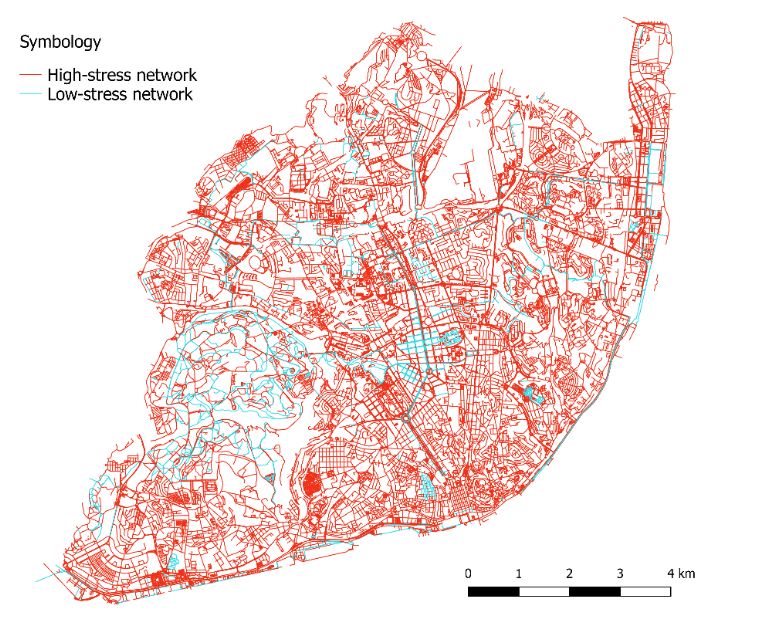
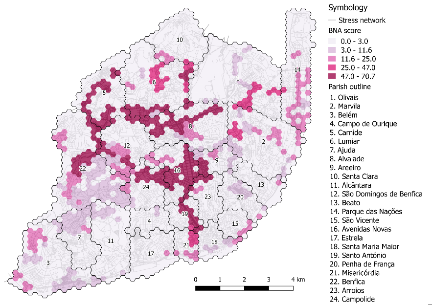

```{r setup, include=FALSE}
knitr::opts_chunk$set(echo = TRUE)
library(knitr)
library(kableExtra)
```

## Introduction

Sustainable mobility has been one of the many strategies adopted by cities to tackle climate change [@Banister2011] and improve the living conditions of their inhabitants. There is no doubt that non-motorized transport has long been the most obvious and easiest mean to implement. Walking and cycling are not only a way to improve our environment, by decreasing air pollution and energy consumption [@Fraser2011]; but also ameliorate citizens health [@DeHartog2010], reduce traffic jams, and reactivate public spaces. Therefore, investing in cycling and pedestrian infrastructure becomes a vital axis of transportation policies in metropolitan areas. Nevertheless, finding the correct way to plan this cycling infrastructure is still a challenge, especially for cities that are just starting. 

### Previous work 

During the first semester I worked together with Luuk van der Meer for the Group Project Seminar focused on python for GIS on a project entitled "Bicycle Network Analysis for the city of Lisbon". The project consisted on developing a Bicycle Network Analysis score that allowed a quantification of the biking network and infrastructure status in Lisbon based on open data. To do so, we analyzed the segments of the existing bike network in Lisbon based on OpenStreetMap, and classified them according to their [level of traffic stress](#PfB) into low and high stress segments (Fig. 1 on the left). Then, we evaluated how well the low stress network connected the cyclists within a biking distance of 6 km to core services like schools, universities, supermarkets, etc., based on an hexagonal grid, where each cell was assigned a value for their connectivity capability from 0 to 100 (Fig. 1 on the right). 

<p align="center">
{ width=40% } { width=45% }
<p>

<center>**Fig. 1:** Stress network and BNA score results for Lisbon.</center>

<br>

The resulting low-stress network was very limited according to the classification criteria. Only 9% out of the 42 294 analyzed segments were classified as low-stress. Finally, an overall BNA score for the city of Lisbon was calculated, based on a weighted average according to the population fraction corresponding to each cell, with a result of 8.6 out of 100 points. The developed tool showed how the use of open data, even with its
limitations, can provide a quantification index of sustainable mobility for a city.

### Proposed work from initial limitations and suggestions

The mentioned analysis results were mainly limited by the fact that the intersections could not be included within the classification criteria for traffic stress level. This was mainly due to the time constraint that we had to develop the project, and therefore would be important to be included on future work to provide a better understanding of the network strengths or weaknesses. 

Additionally, the final report was submitted as a [short paper](https://drive.google.com/file/d/1Hf_sS92RgMJxF5Jo0FhBJdH9_C0sFtcw/view?usp=sharing) to the [Open Data for Open Cities](http://opendata4opencities.uji.es/agendalund/) Second edition of AGILE 2018 Workshop in Lund, Sweden. After presenting, we received some interesting feedback from the workshop participants regarding the possibility to create a tool that designs an optimal bike network when setting a desired BNA score for a city.

Taking into account the suggestions and the mentioned limitations, I decided to expand the project into this direction, coming up with the following research question: *Can a quantitative index based on open and/or crowdsourced data serve as a tool for urban planning of well-connected, low-stress cycling networks?*

### Aim and objectives

The research question derived into the aim of the research which is to develop a methodology to optimize urban cycling networks' connectivity based on a quantitative index known as bike network analysis score. To do so I have established the following objectives: 

* Improve the classification methodology previously developed for street segments (edges) and including also intersections (nodes) conforming the street network of a city into levels of traffic stress based on OpenStreetMap layers, tags, and additional ancillary data.

* Work upon the existing scoring technique which considers the ability of the low-stress bike network to reach core services within a certain biking distance, to also account for office and commercial buildings.

* Establish a methodology to reverse-engineer the process in a way that a desired score can be provided to  obtain as a result low-stress network options for a city by introducing bike paths, bike lanes and zone 30 streets, as well as, bike signalling on conflictive intersections. 

* Apply the methodology as case studies for cities in Europe with limited and/or partly developed bike infrastructure to evaluate the tool performance as a generally applicable methodology for any city and compare the different results. 

## Proposed methodology 

This section includes a description of the background work on which the first part of the research was performed, the data it is based on, and finally the workflow proposed to fulfill the aim and objectives of the current thesis work with a validation scheme of the proposed tool. 

### <a id="PfB"></a>PfB approach

Bicycle network analyses have been undertaken from several angles making use of GIS tools. A recurrent approach within the literature is the level of traffic stress (LTS). @Mekuria2012a, proposed a scheme to classify the road segments in four LTS, ranging from 1 - the level suitable for children - to 4 - the level tolerated by the "strong and fearless" cyclists. Their approach includes an analysis of the network
connectivity with a thorough review of every segment and crossing, allowing an integral characterization of the bike network and assigning each section a stress level.

The [PeopleForBikes](https://peopleforbikes.org/) (PfB) organization developed a Bike Network Analysis (BNA), based on slightly modified LTS, to determine how people could get to common destinations on a comfortable and connected bike network [@PeopleforBikes2014]. Their application targets USA cities and towns, basing their analysis mainly on OpenStreetMap data.

A scoring system, named BNA score, is developed by PfB, defining whether a bike-commuter can reach a destination census block (smallest administrative unit for the US) and main destination points within a biking distance of 10 minutes, computing the total number of destinations accessible with a low-stress bike network from an origin census block. A scoring scale between 0 and 100 is assigned to each destination type, on a stepped manner. Finally, the score is aggregated for the whole area in a weighted averaged fashion. The proposed approach for the thesis consists on basing the underlying methodology of the BNA score calculation to develop a methodology for optimizing the connectivity of urban cycling infrastructures.

### Data

The main source of information to calculate the BNA score is OpenStreetMap (OSM) and basic demographic statistics of a city, usually provided as open data. The [OSM](https://www.openstreetmap.org/) data provides information regarding the street network of the city, including as well the [OpenCycleMap](https://www.opencyclemap.org/) information for the available cycle-way; and the main destinations types including supermarkets, retail markets, schools, colleges, universities, hospitals, clinics, doctors, dentists, among others. The demographic information relies basically on population data, which is usually available as open data for the smallest administrative unit that the country where the city is located handles. An additional peace of information that can be incorporated into the BNA score calculation is street slope, which can be obtained from a DEM of the city, provided its spatial resolution and availability as open data. 

### Work plan 

My work plan is summarized on the following table, which includes the necessary steps or activities that I will require to achieve each one of my objectives to reach the proposed aim. Hover over the objective to view it. 

```{r workplan, warning=FALSE, echo=FALSE, message=FALSE}
tbl <- data.frame(
  Objective = cell_spec(
    c(
      rep("Obj. 1",5),
      rep("Obj. 2",6),
      rep("Obj. 3",5),
      rep("Obj. 4",2),
      rep("Final steps",2)
    ), 
    popover = spec_popover(
    content = c(
      rep("Improve the classification methodology previously developed for street segments (edges) and including also intersections (nodes) conforming the street network of a city into levels of traffic stress based on OpenStreetMap layers, tags, and additional ancillary data.",5),
      rep("Work upon the existing scoring technique which considers the ability of the low-stress bike network to reach core services within a certain biking distance, to also account for office and commercial buildings.",6),
      rep("Establish a methodology to reverse-engineer the process in a way that a desired score can be provided to obtain as a result low-stress network options for a city by introducing bike paths, bike lanes and zone 30 streets, as well as, bike signalling on conflictive intersections.",5),
      rep("Apply the methodology as case studies for cities in Europe with limited and/or partly developed bike infrastructure to evaluate the tool performance as a generally applicable methodology for any city and compare the different results.",2),
      rep("",2)
      ),
    title = NULL, 
    position = "left")
  ),
  No. = c("1.1", "1.2", "1.3", "1.4", "1.5", "2.1", "2.2", "2.3", "2.4", "2.5", "2.6", "3.1", "3.2", "3.3", "3.4", "3.5", "4.1", "4.2", " ", " "),
  Activity = c(
    "Create a conceptual model for a database to handle the data downloaded from OSM as a street network and a collection of vector layers",
    "Categorize the tags available from OSM related to the evaluation of the bike network for segments and intersections",
    "Define pre-processing methods for ancillary data if available e.g. obtain slope from DEM",
    "Establish categorization criteria to divide the segments and intersections into low and high-stress traffic levels considering OSM and ancillary data",
    "Validate the low-stress network generation with existing bike trip data",
    "Identify a way to extract working place locations from OSM tags and include them to the core services to be reached",
    "Design a process to create a point layer of core services, taking into account areas like parks which are represented as polygons",
    "Redefine the scoring and weighting procedure for the available groups of core services",
    "Perform a street network analysis with the low-stress network to determine the amount of core services that can be reached from each cell of a grid overlapping the studied city",
    "Calculate the bike network analysis score, from the scoring criteria for each cell, and for the entire city considering population fraction",
    "Validate the cell scores with existing origin-destination data. ",
    "Determine the restriction rules for turning segments on a street network into a bike-friendly segment",
    "Establish a flow chart to determine the type of bike infrastructure to apply to an existing high-stress segment",
    "Re-categorize the segments into low and high-stress",
    "Re-generate the edges and nodes and calculate the BNA score again until approaching the desired score",
    "Define rules for dealing with an over-optimistic desired score (when it simply cannot be reached given the current street network)",
    "Select cities and obtain the demographic and ancillary data if available",
    "Run the tool and compare and analyze results",
    "Thesis writing",
    "Thesis presentation"
  )
)

kable(tbl, align = "l", escape = FALSE) %>%
  kable_styling(font_size = 11, full_width = F) %>%
  column_spec(2, width = "5em") %>%
  column_spec(3, width = "50em") %>%
  collapse_rows(columns = 1, valign = "middle")
```

For the first two objectives, I also propose a validation procedure which is based on the [Fiets Telweek](http://fietstelweek.nl/data/) bike GPS tracks collected once a year during a week at a national level in the Netherlands with a crowdsourcing app which the citizens volunteer to use. The [data](http://www.bikeprint.nl/fietstelweek/) consists on the following files:

* *edges:* Edges with intensities and speeds
* *nodes:* Nodes with waiting times
* *routes:* Routes with hours and weekdays

To validate the low-stress network generated (Objective 1), I propose to use the Fiets Telweek data set for selected cities in the Netherlands to identify the frequently used commuting routes, and compare them to the low-stress network generated. I base the validation on the hypothesis that if certain routes are frequently used by a large amount of cyclists, then it should have the proper infrastructure and safety measures implemented. 

To validate the cell scores (Objective 2), I propose to derive an origin destination matrix based on the bike trips from the same data set, where I can have a count of the number of trips to each destination, and based on its location within the grid, assume that the cells with highly frequented destinations should be reaching the core services that the BNA score assumes, hence, presenting highly scored cells. 

## References